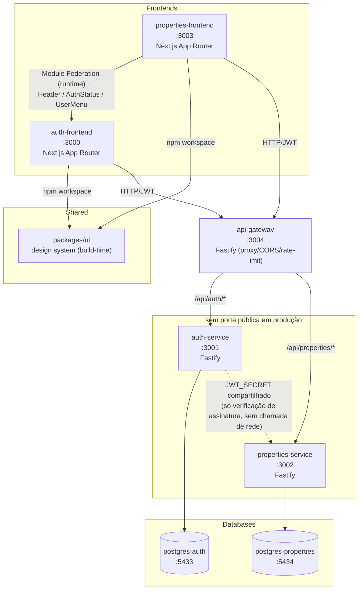

# Plataforma SaaS para Imobiliárias — Micro Frontends + Microservices

Monorepo (npm workspaces) com 2 Micro Frontends e 2 Microservices independentes, seguindo Clean Architecture, SOLID e TDD (cobertura mínima 95%). Domínio: gestão de imóveis para imobiliárias, com arquitetura preparada para IA (recomendação de imóveis, geração de descrição).

📖 **Documentação completa de arquitetura:** [`docs/ARCHITECTURE.md`](docs/ARCHITECTURE.md) — objetivo, requisitos, todas as decisões técnicas (Module Federation, Clean Architecture, segurança, observabilidade, CI/CD, critérios de aceite, regras de desenvolvimento).

## Arquitetura



**Regra de ouro:** nenhum banco é compartilhado entre serviços. Nenhuma feature de auth existe no `properties-frontend`, nenhuma feature de imóveis existe no `auth-frontend`.

### Por que Module Federation _e_ packages/ui ao mesmo tempo?

- `packages/ui`: primitivas estáticas (Button, Input, Card, Modal, Toast, Loading, Error, Layout, Sidebar) — compartilhadas em **build-time** via npm workspace. Não mudam por deploy independente.
- Module Federation: só os componentes que carregam **estado vivo de autenticação** (`Header`, `AuthStatus`, `UserMenu`) — o `auth-frontend` é o dono desse estado e expõe em **runtime**; o `properties-frontend` consome como remote. Cada mecanismo resolve o problema que sabe resolver melhor.

### Por que api-gateway?

Único ponto de entrada HTTP público pros services. Frontends nunca chamam `auth-service`/`properties-service` direto — sempre via `api-gateway`, que faz proxy + centraliza CORS/rate-limit/`x-request-id`. Autenticação (verificação de JWT) continua descentralizada, local em cada service — o gateway não guarda `JWT_SECRET`, só transporta o header `Authorization`. Detalhes: `docs/ARCHITECTURE.md` seção 04a.

## Portas

| Projeto             | Porta | Tipo       | Exposta em produção                 |
| ------------------- | ----- | ---------- | ----------------------------------- |
| auth-frontend       | 3000  | Next.js    | Sim                                 |
| auth-service        | 3001  | Fastify    | Não — só rede interna (via gateway) |
| properties-service  | 3002  | Fastify    | Não — só rede interna (via gateway) |
| properties-frontend | 3003  | Next.js    | Sim                                 |
| api-gateway         | 3004  | Fastify    | Sim — único backend público         |
| postgres-auth       | 5433  | PostgreSQL | Não                                 |
| postgres-properties | 5434  | PostgreSQL | Não                                 |

## Estrutura

```
apps/
  auth-frontend/         Micro Frontend de autenticação
  properties-frontend/   Micro Frontend de imóveis (dashboard, listagem, CRUD, busca, filtros)
services/
  auth-service/          Microservice de autenticação
  properties-service/    Microservice de imóveis (CRUD, busca, filtros, regras de negócio, contratos de IA)
  api-gateway/           Proxy único pros services (CORS, rate-limit, request-id) — sem regra de negócio
packages/
  ui/                    Design system compartilhado (shadcn/ui)
```

## Roadmap de fases

- [x] **Fase 0** — Scaffold do monorepo, tooling (ESLint/Prettier/Husky/commitlint), docker-compose skeleton
- [x] **Fase 1** — `packages/ui` (design system) — 10 componentes, 68 testes, 100% cobertura (stmts/funcs/lines)
- [x] **Fase 2** — `auth-service` (backend completo, TDD) — 101 testes, 100% cobertura (exceto repositórios Prisma — testes de integração escritos, pendente Docker pra rodar)
- [ ] **Fase 2a** — `api-gateway` (proxy Fastify + CORS + rate-limit, TDD)
- [ ] **Fase 3** — `auth-frontend` (MFE completo, TDD — consome só o api-gateway)
- [ ] **Fase 4** — `properties-service` (backend completo, TDD — entidade `Property`, CRUD, busca/filtros, contratos de IA)
- [ ] **Fase 5** — `properties-frontend` (MFE completo, TDD — dashboard, listagem, CRUD, busca, filtros)
- [ ] **Fase 6** — Module Federation wiring + docker-compose completo + smoke e2e
- [ ] **Fase 7** — Documentação final (diagramas, fluxos de auth/MFE/microservices)

> **Nota de domínio:** o projeto nasceu como demo genérica de "produtos" e foi redirecionado para o domínio de imobiliárias antes da Fase 4/5 começarem — não há dado ou código de "Product" implementado para migrar, só o rename do planejamento. Ver `docs/ARCHITECTURE.md` para o histórico da decisão.

## Como rodar (estado atual — Fase 1 concluída, Fase 2 em andamento)

```bash
npm install                 # instala deps de todos os workspaces
npx husky install           # ativa git hooks (pre-commit, commit-msg)

docker compose config       # valida docker-compose.yml
docker compose up postgres-auth postgres-properties -d
docker compose ps           # confirma os 2 bancos healthy
```

Os comandos `dev`/`build`/`test` de cada app/service só ficam funcionais a partir da fase em que forem implementados (ver roadmap acima).

## Como testar

```bash
npm run test                # roda testes de todos os workspaces (--if-present)
npm run test:coverage       # cobertura agregada
```

TDD obrigatório a partir da Fase 1 — nenhuma funcionalidade é implementada sem teste escrito antes. Cobertura mínima: 95%.

## Como fazer deploy

Cada app/service tem seu próprio `Dockerfile` (a partir da fase em que é implementado) e é build/deployado de forma independente. `docker-compose.yml` orquestra o stack completo para ambiente local/staging — detalhado na Fase 6.

## Git — fluxo

GitFlow: `main` (produção) + `develop` (integração) + `feature/*` / `release/*` / `hotfix/*`. Commits seguem Conventional Commits (validado via commitlint no hook `commit-msg`).
