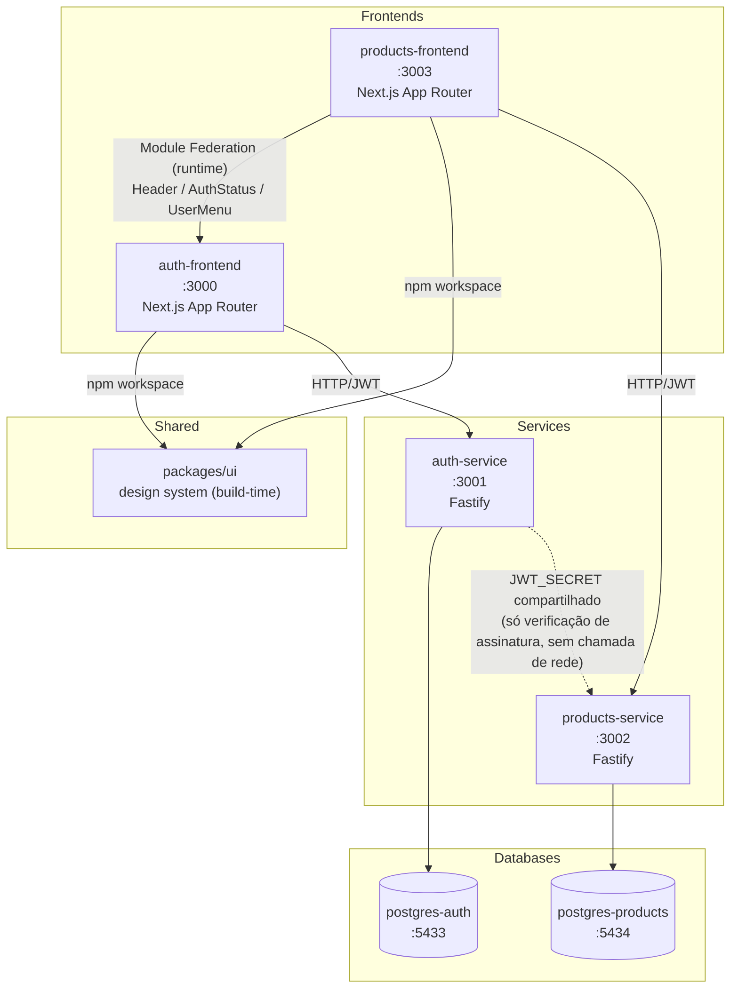

# Plataforma Micro Frontends + Microservices — Auth & Products

Monorepo (npm workspaces) com 2 Micro Frontends e 2 Microservices independentes, seguindo Clean Architecture, SOLID e TDD (cobertura mínima 95%).

## Arquitetura



**Regra de ouro:** nenhum banco é compartilhado entre serviços. Nenhuma feature de auth existe no `products-frontend`, nenhuma feature de produtos existe no `auth-frontend`.

### Por que Module Federation _e_ packages/ui ao mesmo tempo?

- `packages/ui`: primitivas estáticas (Button, Input, Card, Modal, Toast, Loading, Error, Layout, Sidebar) — compartilhadas em **build-time** via npm workspace. Não mudam por deploy independente.
- Module Federation: só os componentes que carregam **estado vivo de autenticação** (`Header`, `AuthStatus`, `UserMenu`) — o `auth-frontend` é o dono desse estado e expõe em **runtime**; o `products-frontend` consome como remote. Cada mecanismo resolve o problema que sabe resolver melhor.

## Portas

| Projeto           | Porta | Tipo       |
| ----------------- | ----- | ---------- |
| auth-frontend     | 3000  | Next.js    |
| auth-service      | 3001  | Fastify    |
| products-service  | 3002  | Fastify    |
| products-frontend | 3003  | Next.js    |
| postgres-auth     | 5433  | PostgreSQL |
| postgres-products | 5434  | PostgreSQL |

## Estrutura

```
apps/
  auth-frontend/       Micro Frontend de autenticação
  products-frontend/   Micro Frontend de produtos
services/
  auth-service/        Microservice de autenticação
  products-service/     Microservice de produtos
packages/
  ui/                  Design system compartilhado (shadcn/ui)
```

## Roadmap de fases

- [x] **Fase 0** — Scaffold do monorepo, tooling (ESLint/Prettier/Husky/commitlint), docker-compose skeleton
- [ ] **Fase 1** — `packages/ui` (design system)
- [ ] **Fase 2** — `auth-service` (backend completo, TDD)
- [ ] **Fase 3** — `auth-frontend` (MFE completo, TDD)
- [ ] **Fase 4** — `products-service` (backend completo, TDD)
- [ ] **Fase 5** — `products-frontend` (MFE completo, TDD)
- [ ] **Fase 6** — Module Federation wiring + docker-compose completo + smoke e2e
- [ ] **Fase 7** — Documentação final (diagramas, fluxos de auth/MFE/microservices)

## Como rodar (estado atual — Fase 0)

```bash
npm install                 # instala deps de todos os workspaces
npx husky install           # ativa git hooks (pre-commit, commit-msg)

docker compose config       # valida docker-compose.yml
docker compose up postgres-auth postgres-products -d
docker compose ps           # confirma os 2 bancos healthy
```

Os comandos `dev`/`build`/`test` de cada app/service só ficam funcionais a partir da fase em que forem implementados (ver roadmap acima).

## Como testar

```bash
npm run test                # roda testes de todos os workspaces (--if-present)
npm run test:coverage       # cobertura agregada
```

TDD obrigatório a partir da Fase 1 — nenhuma funcionalidade é implementada sem teste escrito antes. Cobertura mínima: 95%.

## Como fazer deploy

Cada app/service tem seu próprio `Dockerfile` (a partir da fase em que é implementado) e é build/deployado de forma independente. `docker-compose.yml` orquestra o stack completo para ambiente local/staging — detalhado na Fase 6.

## Git — fluxo

GitFlow: `main` (produção) + `develop` (integração) + `feature/*` / `release/*` / `hotfix/*`. Commits seguem Conventional Commits (validado via commitlint no hook `commit-msg`).
