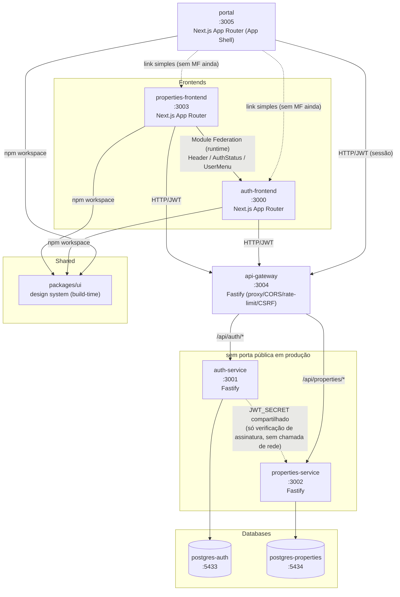

# Plataforma SaaS para Imobiliárias — Micro Frontends + Microservices

Monorepo (npm workspaces) com 2 Micro Frontends e 2 Microservices independentes, seguindo Clean Architecture, SOLID e TDD (cobertura mínima 95%). Domínio: gestão de imóveis para imobiliárias, com arquitetura preparada para IA (recomendação de imóveis, geração de descrição).

📖 **Documentação completa de arquitetura:** [`docs/ARCHITECTURE.md`](docs/ARCHITECTURE.md) — objetivo, requisitos, todas as decisões técnicas (Module Federation, Clean Architecture, segurança, observabilidade, CI/CD, critérios de aceite, regras de desenvolvimento).

## Arquitetura



**Regra de ouro:** nenhum banco é compartilhado entre serviços. Nenhuma feature de auth existe no `properties-frontend`, nenhuma feature de imóveis existe no `auth-frontend`. O `portal` nunca tem regra de negócio — só layout, navegação, providers e verificação de sessão (`docs/ARCHITECTURE.md` seção 05a).

> **Estado atual (Fase 6):** a seta de Module Federation no diagrama acima está implementada — `properties-frontend` (host) consome `Header` de `auth-frontend` (remote) via `ModuleFederationPlugin` cru (`@module-federation/enhanced/webpack`; `@module-federation/nextjs-mf` nunca suportou App Router e foi descontinuado pelo ecossistema — ver `docs/ARCHITECTURE.md` seção 06). Ainda assim, `properties-frontend` não tem UI de sessão própria além do `Header` federado: um `middleware.ts` local checa a presença do cookie de refresh e redireciona pro `auth-frontend` (cross-origin) quando ausente; a sessão obtida (refresh silencioso via `api-gateway`) autentica normalmente as chamadas a `properties-service`.
>
> **Estado atual (Fase 8):** `portal` existe como App Shell, mas ainda não participa de Module Federation — os links pra `auth-frontend`/`properties-frontend` no diagrama acima são navegação simples (`<a href>`), não remotes federados. Os contratos que preparam essa integração (`RemoteManifest`/`RemoteRegistry`/`RemoteResolver`/`ModuleLoader`/`RemoteLoader`) já existem em `apps/portal/src/types/federation/`, sem implementação concreta ainda (exceto `RemoteRegistry`, puro bookkeeping de dados).

### Por que Module Federation _e_ packages/ui ao mesmo tempo?

- `packages/ui`: primitivas estáticas (Button, Input, Card, Modal, Toast, Loading, Error, Layout, Sidebar) — compartilhadas em **build-time** via npm workspace. Não mudam por deploy independente.
- Module Federation: só os componentes que carregam **estado vivo de autenticação** (`Header`, `AuthStatus`, `UserMenu`) — o `auth-frontend` é o dono desse estado e expõe em **runtime**; o `properties-frontend` consome como remote. Cada mecanismo resolve o problema que sabe resolver melhor.

### Por que api-gateway?

Único ponto de entrada HTTP público pros services. Frontends nunca chamam `auth-service`/`properties-service` direto — sempre via `api-gateway`, que faz proxy + centraliza CORS/rate-limit/`x-request-id`. Autenticação (verificação de JWT) continua descentralizada, local em cada service — o gateway não guarda `JWT_SECRET`, só transporta o header `Authorization`. Detalhes: `docs/ARCHITECTURE.md` seção 04a.

## Portas

| Projeto             | Porta | Tipo       | Exposta em produção                         |
| ------------------- | ----- | ---------- | ------------------------------------------- |
| auth-frontend       | 3000  | Next.js    | Sim                                         |
| auth-service        | 3001  | Fastify    | Não — só rede interna (via gateway)         |
| properties-service  | 3002  | Fastify    | Não — só rede interna (via gateway)         |
| properties-frontend | 3003  | Next.js    | Sim                                         |
| api-gateway         | 3004  | Fastify    | Sim — único backend público                 |
| portal              | 3005  | Next.js    | Sim — sem Dockerfile/compose ainda (Fase 8) |
| postgres-auth       | 5433  | PostgreSQL | Não                                         |
| postgres-properties | 5434  | PostgreSQL | Não                                         |

## Estrutura

```
apps/
  portal/                App Shell — layout global, navegação, providers, guard de sessão (sem regra de negócio)
  auth-frontend/         Micro Frontend de autenticação
  properties-frontend/   Micro Frontend de imóveis (dashboard, listagem, CRUD, busca, filtros)
services/
  auth-service/          Microservice de autenticação
  properties-service/    Microservice de imóveis (CRUD, busca, filtros, regras de negócio, contratos de IA)
  api-gateway/           Proxy único pros services (CORS, rate-limit, request-id) — sem regra de negócio
packages/
  ui/                    Design system compartilhado (shadcn/ui)
```

## Roadmap de fases

- [x] **Fase 0** — Scaffold do monorepo, tooling (ESLint/Prettier/Husky/commitlint), docker-compose skeleton
- [x] **Fase 1** — `packages/ui` (design system) — 10 componentes, 68 testes, 100% cobertura (stmts/funcs/lines)
- [x] **Fase 2** — `auth-service` (backend completo, TDD) — 101 testes, 100% cobertura (exceto repositórios Prisma — testes de integração escritos, pendente Docker pra rodar)
- [x] **Fase 2a** — `api-gateway` (proxy Fastify + CORS + rate-limit, TDD) — 19 testes, cobertura ≥95%
- [x] **Fase 3** — `auth-frontend` (MFE completo, TDD — consome só o api-gateway) — 70 testes, 100% cobertura (exceto `app/` e `mocks/`)
- [x] **Fase 4** — `properties-service` (backend completo, TDD — entidade `Property`, CRUD, busca/filtros, métricas de dashboard, contratos de IA) — 87 testes, 100% cobertura (exceto repositório Prisma — testes de integração escritos, pendente Docker pra rodar)
- [x] **Fase 5** — `properties-frontend` (MFE completo, TDD — dashboard, listagem, cadastro, edição, exclusão, busca, filtros, paginação) — 78 testes, 100% cobertura (exceto `app/`, `mocks/`, `test-utils/`, `types/`)
- [x] **Fase 6** — Module Federation wiring (`ModuleFederationPlugin` cru) + docker-compose completo (7 serviços healthy) + smoke e2e via curl (registro → login → CRUD de imóveis → métricas, tudo via api-gateway) + CI/CD (GitHub Actions)
- [x] **Fase 7** — Observabilidade real (OpenTelemetry tracing HTTP+Prisma, correlação `x-request-id` ponta-a-ponta), segurança (CSRF Origin/Referer guard no `api-gateway`, Pino `redact`, `connection_limit` no Prisma), `error.tsx`/`React.memo` nos frontends, e documentação final consolidada (diagrama do pipeline de requisição no `api-gateway`) — `api-gateway` com 33 testes, cobertura ≥95%
- [x] **Fase 8** — `apps/portal` (App Shell, TDD — layout global, navegação, providers, `SessionContext`/guard de sessão, contratos de Module Federation) + 6 novos primitivos em `packages/ui` (`Footer`, `Breadcrumb`, `Avatar`, `DropdownMenu`, `ThemeProvider`/`ThemeToggle`, `Sidebar` recolhível) — `portal` com 92 testes, `packages/ui` com 97 testes, cobertura ≥95% em ambos
- [x] **Fase 9** — Atualização de dependências nos 7 workspaces: React 18→19, Next.js 15→16 (`--webpack` nos 2 apps com Module Federation, Turbopack padrão no `portal`), Prisma 5→7 (driver adapter + `prisma.config.ts`, seção 12), Tailwind v3→v4 (CSS-first, seção 08), + 10 outras majors (fastify plugins, `bcryptjs`, `@hookform/resolvers`+`react-hook-form`, `lucide-react`, `tailwind-merge`, `jsdom`, `vitest`+`@vitest/coverage-v8`+`@vitejs/plugin-react`/Vite 8) — `@testcontainers/postgresql` v12 **não** atualizado (exige Node ≥22.19, nosso runtime é Node 20 — bloqueio de versão documentado, não escolha). 561 testes existentes (nenhum novo nesta fase) validados contra toda a árvore de dependências nova + smoke test manual de MF (dev server) + build completo do `docker compose` com os 7 containers de pé

> **Nota de domínio:** o projeto nasceu como demo genérica de "produtos" e foi redirecionado para o domínio de imobiliárias antes da Fase 4/5 começarem — não há dado ou código de "Product" implementado para migrar, só o rename do planejamento. Ver `docs/ARCHITECTURE.md` para o histórico da decisão.

## Como rodar (estado atual — Fases 0–6 concluídas)

```bash
npm install                 # instala deps de todos os workspaces
npx husky install           # ativa git hooks (pre-commit, commit-msg)

docker compose config       # valida docker-compose.yml
docker compose up postgres-auth postgres-properties -d
docker compose ps           # confirma os 2 bancos healthy

# stack completa (bancos + auth-service + properties-service + api-gateway + os 2 frontends):
docker compose up -d
curl http://localhost:3004/health/ready   # { status, services: { auth: true, properties: true } }
# abrir http://localhost:3003 no browser (redireciona pro login em localhost:3000 se não autenticado)
```

Os comandos `dev`/`build`/`test` de cada app/service só ficam funcionais a partir da fase em que forem implementados (ver roadmap acima). `properties-frontend` não tem login próprio — se não autenticado, o `middleware.ts` redireciona pro `auth-frontend`; depois do login, o cookie de refresh (compartilhado entre portas do mesmo host) autentica as chamadas via `api-gateway`.

Um `Makefile` na raiz atalhia os comandos mais comuns (`make test`, `make docker-up`, `make lint`, etc. — ver `make help` ou o arquivo pra lista completa). Requer `make` instalado (não vem por padrão no Git Bash do Windows — instale via `choco install make`, WSL, ou use os comandos `npm run`/`docker compose` diretos acima).

## Como testar

```bash
npm run test                # roda testes de todos os workspaces (--if-present)
npm run test:coverage       # cobertura agregada
# ou: make test / make test-coverage
```

TDD obrigatório a partir da Fase 1 — nenhuma funcionalidade é implementada sem teste escrito antes. Cobertura mínima: 95%.

## Como fazer deploy

Cada app/service tem seu próprio `Dockerfile` e é build/deployado de forma independente. `docker-compose.yml` orquestra o stack completo (7 serviços: 2 bancos, 3 backends, 2 frontends) para ambiente local/staging — validado end-to-end na Fase 6.

## CI/CD

`.github/workflows/ci.yml` — lint, typecheck, test (com gate de cobertura 95% embutido nos thresholds do Vitest) e build rodam em todo PR/push pra `develop`/`main`; build das 5 imagens Docker roda em push pra `main`. Detalhes: `docs/ARCHITECTURE.md` seção 21.

## Git — fluxo

GitFlow: `main` (produção) + `develop` (integração) + `feature/*` / `release/*` / `hotfix/*`. Commits seguem Conventional Commits (validado via commitlint no hook `commit-msg`).
