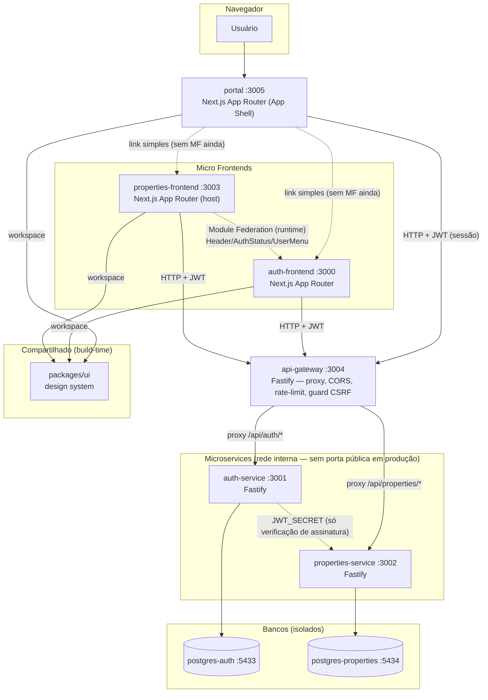
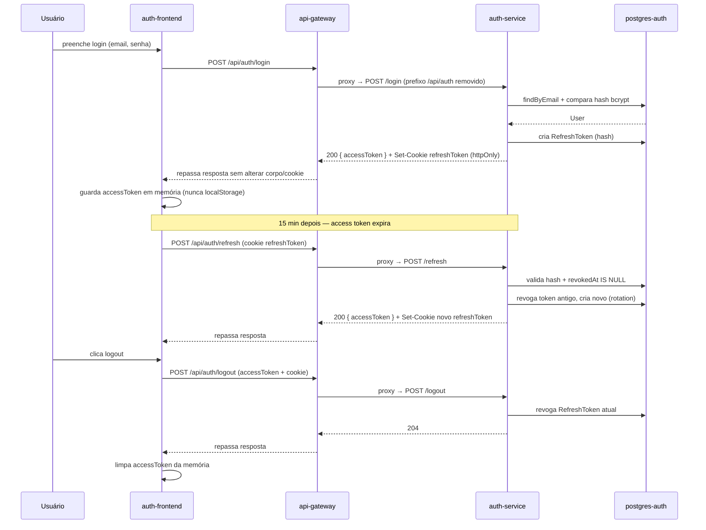
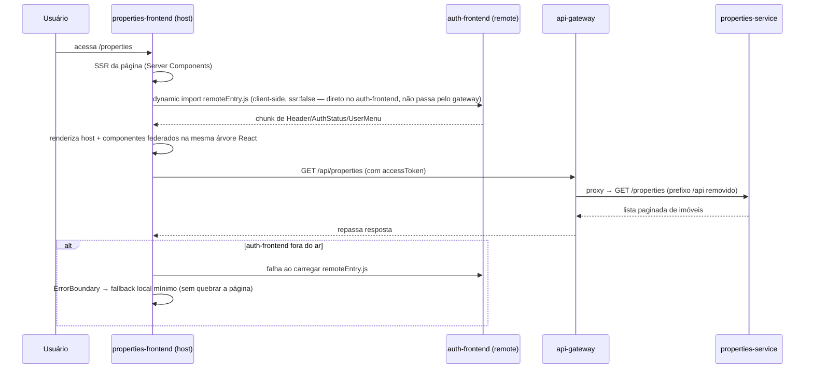
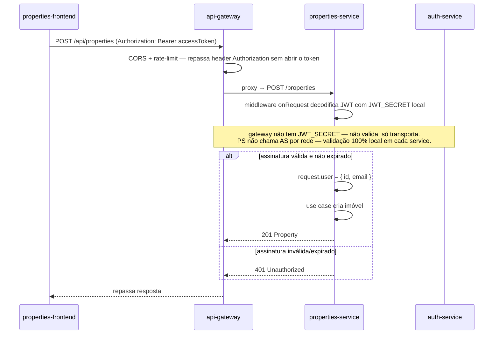
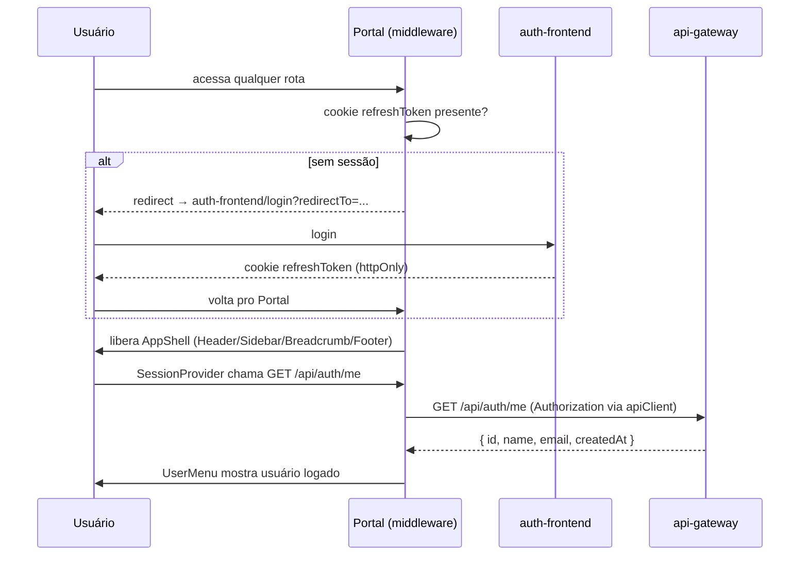
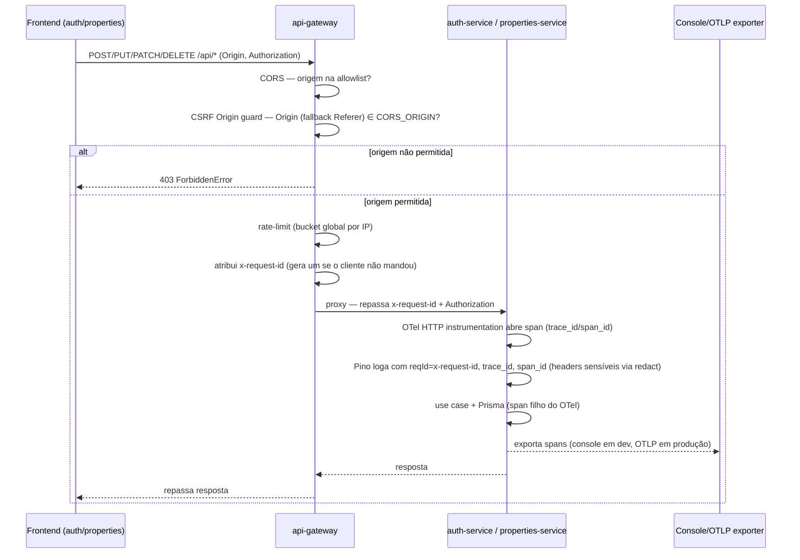

# Arquitetura — Plataforma SaaS para Imobiliárias (Auth & Property Management)

> Documento vivo. Atualizado a cada fase do roadmap. Ver status de implementação em `/README.md`.

---

## 00. Histórico de decisão — pivot de domínio

O projeto começou como demo genérica de "produtos" (Fase 0/1) e foi redirecionado pra um **SaaS de gestão de imóveis pra imobiliárias** antes da Fase 4/5 começarem. Nada do domínio `Product` chegou a ser implementado — só existia em placeholders (`package.json`/`README`) e neste documento. O pivot foi, portanto, um rename de planejamento (`products-frontend`→`properties-frontend`, `products-service`→`properties-service`, `postgres-products`→`postgres-properties`), não uma migração de dados reais. `auth-service` (em implementação) e `packages/ui` (concluído) são agnósticos de domínio e não foram afetados.

---

## 01. Objetivo do projeto

Construir uma plataforma SaaS de referência para **imobiliárias** — gestão de imóveis (cadastro, busca, filtros, dashboard) — demonstrando, em código real e testado, como compor uma aplicação usando **Micro Frontends** (Next.js + Module Federation) e **Microservices** (Fastify + Prisma), com dois domínios de negócio isolados — **autenticação** e **imóveis** — comunicando-se por contratos explícitos (HTTP + JWT no backend, Module Federation + eventos no frontend), sem nunca compartilhar banco de dados ou lógica de negócio entre domínios.

Serve como baseline de engenharia para: Clean Architecture, SOLID, TDD com cobertura mínima de 95%, Repository Pattern, Dependency Injection e isolamento real de deploy entre partes do sistema. A arquitetura do `properties-service` já nasce preparada (contratos/interfaces, sem implementação) para integrações futuras de IA — recomendação de imóveis, geração de descrição — ver seção 10.

**Não-objetivos (por enquanto):** não implementa IA de fato (só os contratos/abstrações); não cobre pagamento, contrato digital ou assinatura eletrônica; não é um CRM completo de leads.

---

## 02. Requisitos funcionais

### Auth (auth-frontend + auth-service)

| #    | Requisito                                                                                       |
| ---- | ----------------------------------------------------------------------------------------------- |
| RF01 | Usuário se cadastra com nome, email e senha                                                     |
| RF02 | Usuário faz login com email e senha, recebe access token + refresh token                        |
| RF03 | Access token expira em 15 min; sistema renova via refresh token automaticamente, sem novo login |
| RF04 | Usuário faz logout — refresh token correspondente é invalidado no banco                         |
| RF05 | Usuário visualiza seu próprio perfil (nome, email, data de criação)                             |
| RF06 | Senhas nunca trafegam nem são persistidas em texto puro (hash bcrypt)                           |

### Properties (properties-frontend + properties-service)

| #    | Requisito                                                                                                                                     |
| ---- | --------------------------------------------------------------------------------------------------------------------------------------------- |
| RF07 | Usuário autenticado lista imóveis, paginados e ordenáveis                                                                                     |
| RF08 | Usuário busca imóveis por título/descrição/endereço                                                                                           |
| RF09 | Usuário filtra imóveis por cidade, bairro, tipo, preço, quartos, banheiros, vagas de garagem, área, status, aceita financiamento, aceita pets |
| RF10 | Usuário autenticado cadastra novo imóvel (todos os campos da entidade `Property` — ver seção 10)                                              |
| RF11 | Usuário autenticado edita imóvel existente                                                                                                    |
| RF12 | Usuário autenticado exclui imóvel                                                                                                             |
| RF13 | Usuário visualiza detalhes de um imóvel específico                                                                                            |
| RF14 | Usuário não autenticado é redirecionado para `auth-frontend` ao tentar acessar qualquer rota de imóveis                                       |
| RF15 | Dashboard exibe métricas: quantidade total, vendidos, alugados, disponíveis, preço médio, distribuição por cidade e por bairro                |

### Cross-cutting

| #    | Requisito                                                                                                                                             |
| ---- | ----------------------------------------------------------------------------------------------------------------------------------------------------- |
| RF16 | `properties-frontend` exibe estado de autenticação (nome do usuário, avatar, logout) sem reimplementar lógica de auth — consome via Module Federation |
| RF17 | Tema (light/dark) e componentes visuais são consistentes entre os dois frontends                                                                      |

---

## 03. Requisitos não funcionais

| #     | Requisito                                                                                         | Como é atendido                                                                                   |
| ----- | ------------------------------------------------------------------------------------------------- | ------------------------------------------------------------------------------------------------- |
| RNF01 | Cobertura de testes ≥ 95% em toda camada de aplicação/domínio                                     | Vitest (frontend) + Vitest/Supertest (backend), threshold enforced em CI                          |
| RNF02 | Zero uso de `any` em TypeScript                                                                   | `strict: true` + `@typescript-eslint/no-explicit-any: error`                                      |
| RNF03 | Cada serviço/app deployável de forma 100% independente                                            | `package.json` próprio, `Dockerfile` próprio, banco próprio                                       |
| RNF04 | Nenhum serviço acessa banco de outro serviço                                                      | Bancos físicos separados (`auth_db`, `properties_db`), sem VPN/rede compartilhada de DB           |
| RNF05 | Autenticação stateless entre serviços (sem chamada síncrona serviço-a-serviço para validar token) | JWT HS256 com segredo compartilhado via env var — cada serviço valida assinatura localmente       |
| RNF06 | Tempo de resposta p95 < 300ms em rotas de leitura sob carga local                                 | Índices Prisma nos campos de busca/filtro, paginação obrigatória                                  |
| RNF07 | Acessibilidade (a11y) nos componentes de UI                                                       | Radix UI (primitivas acessíveis) + `eslint-plugin-jsx-a11y`                                       |
| RNF08 | Observabilidade mínima (logs estruturados, health checks)                                         | Pino nos serviços Fastify, rotas `/health` e `/health/ready`                                      |
| RNF09 | Repositório auditável — histórico de commits semântico e rastreável                               | Conventional Commits + GitFlow, validado via `commitlint` no `commit-msg` hook                    |
| RNF10 | Segurança de senha e sessão seguindo boas práticas OWASP                                          | bcrypt (cost 10+), cookies `httpOnly`/`Secure`/`SameSite`, refresh token rotacionável e revogável |

---

## 04. Arquitetura geral



**Princípios que governam toda decisão de arquitetura neste projeto:**

1. **Isolamento de domínio primeiro.** Auth e Properties nunca importam código um do outro, nunca compartilham banco. A única ponte é HTTP (backend) e Module Federation/eventos (frontend).
2. **Dependência aponta para dentro.** Em cada serviço/app, `domain` não conhece `infra`; `infra` implementa interfaces definidas em `domain`. Ver seção 13.
3. **Testável por construção.** Toda regra de negócio é isolável de I/O (banco, HTTP, filesystem) via injeção de dependência — permite testar sem mocks frágeis de framework.
4. **Cada camada só resolve um tipo de problema.** Zod valida forma; use case decide regra de negócio; repository decide acesso a dado. Nunca misturar.
5. **Um único ponto de entrada público pros services.** `auth-frontend`/`properties-frontend` nunca chamam `auth-service`/`properties-service` direto — sempre via `api-gateway` (seção 04a). Autenticação (verificação de JWT) continua descentralizada em cada service — o gateway não decide quem está autenticado, só encaminha.

### Fluxo de autenticação (login → refresh → logout)



### Fluxo Micro Frontends (Module Federation em runtime)



Nota: o `remoteEntry.js` do Module Federation é buscado **direto no `auth-frontend`** (ativo estático servido pela própria origem dele) — não passa pelo `api-gateway`, que só encaminha tráfego de API (`/api/*`), não assets de build.

### Fluxo Microservices (isolamento de validação JWT)



---

## 04a. API Gateway

Novo serviço `services/api-gateway` (Fastify) — **único ponto de entrada HTTP público** pra `auth-service` e `properties-service`. `auth-frontend` e `properties-frontend` nunca chamam esses services direto — só o gateway (princípio 5 da seção 04). Em produção, `auth-service`/`properties-service` não publicam porta pro host, só ficam acessíveis na rede interna do Docker (seção 20); em dev local a porta continua exposta pra debug direto via curl/Insomnia, nunca usada pelo código do frontend.

### Responsabilidade: proxy + cross-cutting, nunca regra de negócio

| Rota (gateway)                     | Encaminha para                                      | Prefixo removido antes do proxy                            |
| ---------------------------------- | --------------------------------------------------- | ---------------------------------------------------------- |
| `/api/auth/*`                      | `auth-service` (env `AUTH_SERVICE_URL`)             | `/api/auth` → ex.: `/api/auth/login` vira `/login`         |
| `/api/properties/*`                | `properties-service` (env `PROPERTIES_SERVICE_URL`) | `/api` → ex.: `/api/properties/123` vira `/properties/123` |
| `GET /health`, `GET /health/ready` | resolvido localmente no gateway                     | — (readiness verifica se os dois services respondem)       |

Implementação: `@fastify/http-proxy` (plugin oficial do ecossistema Fastify), registrado uma vez por service upstream. Sem lógica própria de domínio — se um dia o gateway precisar de uma regra de negócio, é sinal de que ela pertence a um dos services, não a ele (viola SRP, seção 14).

### O que passa a ser centralizado aqui (e o que continua descentralizado)

| Concern            | Antes (por service)                   | Agora                                                                                                                      |
| ------------------ | ------------------------------------- | -------------------------------------------------------------------------------------------------------------------------- |
| CORS               | `@fastify/cors` em cada service       | Só no gateway — services internos não recebem mais tráfego de browser direto, não precisam validar `Origin`                |
| Rate limiting      | `@fastify/rate-limit` em cada service | Só no gateway, por IP + rota — um único lugar pra ajustar limite global (seção 18)                                         |
| `x-request-id`     | Gerado em cada service se ausente     | Gerado no gateway (primeiro ponto de contato) se ausente, propagado até o banco (seção 25)                                 |
| Verificação de JWT | Local em cada service                 | **Continua local em cada service** — o gateway repassa o header `Authorization` sem abrir o token, não guarda `JWT_SECRET` |

**Por que o gateway não valida JWT:** se ele validasse e os services confiassem cegamente nisso, um bypass de rede (acesso direto a um service, erro de config) viraria falha de autenticação silenciosa. Mantendo RNF05 (seção 03) intacto — cada service segue sendo a fonte da verdade da própria autorização; o gateway é só transporte, nunca decisor.

### Docker

`services/api-gateway/Dockerfile` segue o mesmo shape multi-stage da seção 19. É o único serviço dessa camada com porta publicada no host em produção (`API_GATEWAY_PORT`, default `3004`).

---

## 05. Micro Frontends

Dois apps Next.js (App Router) totalmente independentes, cada um com seu próprio `package.json`, build, deploy e porta:

| App                   | Porta | Domínio                                                                   | Não pode conter                                                        |
| --------------------- | ----- | ------------------------------------------------------------------------- | ---------------------------------------------------------------------- |
| `auth-frontend`       | 3000  | login, cadastro, logout, refresh, perfil                                  | lógica de imóveis                                                      |
| `properties-frontend` | 3003  | dashboard, listagem, CRUD, busca, filtros, paginação, detalhes de imóveis | lógica de autenticação (exceto checar/redirecionar se não autenticado) |

**Regra de fronteira:** `properties-frontend` sabe que existe "um usuário autenticado ou não" — mas não sabe _como_ login funciona. Essa fronteira é o contrato exposto por Module Federation (seção 06) + a API pública do `auth-service` (seção 09).

Cada MFE segue a estrutura feature-based descrita em `references/architecture.md` da skill: `features/<domínio>/<subfeature>/{components,hooks,services,schemas,types}` com `index.ts` de contrato público.

---

## 05a. Portal (App Shell)

Novo app `apps/portal` (porta 3005, Fase 8) — **App Shell corporativo**: layout global (Header/Sidebar/Breadcrumb/Footer), providers globais, roteamento principal e autorização de acesso. Segue o mesmo racional de fronteira do `api-gateway` (seção 04a): centraliza cross-cutting, nunca regra de negócio.

**Nunca contém:** regra de negócio, acesso a banco/Prisma, CRUD. Toda regra de negócio continua nos MFEs/microservices existentes — o Portal só decide _layout_ e _pra onde navegar_.

### Responsabilidade

| Camada              | Componentes                                                                                                                                                   |
| ------------------- | ------------------------------------------------------------------------------------------------------------------------------------------------------------- |
| `layouts/`          | `AppShell` (composição raiz), `PortalHeader`, `PortalSidebar`, `PortalFooter`, `PortalBreadcrumb` — todos compõem primitivos de `packages/ui`, nunca duplicam |
| `providers/`        | `AppProviders` (`QueryClientProvider` → `ThemeProvider` → `SessionProvider` → `Toaster`), `SessionProvider`                                                   |
| `contexts/`         | `SessionContext` — abstração que `UserMenu`/`PortalHeader` consomem (DIP: nunca leem `useSession`/TanStack Query direto)                                      |
| `hooks/`            | `useSession` — `useQuery` sobre `GET /api/auth/me`                                                                                                            |
| `services/`         | `session.service.ts`, `logout.service.ts` — mesma camada `apiClient` das outras apps                                                                          |
| `routes/`           | `modules.ts` — single source of truth de navegação (Sidebar e home institucional leem daqui)                                                                  |
| `types/federation/` | Contratos de Module Federation (abaixo)                                                                                                                       |
| `middleware.ts`     | Protege toda rota (mesmo padrão do `properties-frontend`) — sem cookie de refresh, redireciona pro `auth-frontend`                                            |

### Novos primitivos em `packages/ui`

Pra montar o Portal sem duplicar Design System: `Footer`, `Breadcrumb`, `Avatar` (`@radix-ui/react-avatar`), `DropdownMenu` (`@radix-ui/react-dropdown-menu`), `ThemeProvider`/`useTheme`/`ThemeToggle` (mecanismo de tema — o app só monta, mesmo padrão do `Toaster`). `Sidebar` ganhou um prop `collapsed?: boolean` (esconde o label via `sr-only`, mantém acessível).

### Navegação — mapeamento de módulos

`routes/modules.ts` é a única fonte de verdade (lida por `PortalSidebar` e pela home institucional):

| Módulo (Sidebar)                                               | Rota                                                                | Tipo          | Destino                                                                                        |
| -------------------------------------------------------------- | ------------------------------------------------------------------- | ------------- | ---------------------------------------------------------------------------------------------- |
| Dashboard                                                      | `/`                                                                 | `internal`    | Home institucional do próprio Portal (grid de cards)                                           |
| Imóveis                                                        | `/`                                                                 | `external`    | `NEXT_PUBLIC_PROPERTIES_FRONTEND_URL` — MFE real já existente                                  |
| Clientes, Visitas, IA, Analytics, Administração, Configurações | `/clients`, `/visits`, `/chat`, `/analytics`, `/admin`, `/settings` | `placeholder` | Rota própria do Portal, renderiza `PlaceholderModule` ("Em construção") — MFE ainda não existe |

"Imóveis" navega por **link simples**, não Module Federation — é o que existe de verdade hoje (sem app "shell" cadastrando remotes ainda). Quando um módulo `placeholder` ganhar um MFE real, a rota interna correspondente é substituída por um link externo (ou, quando a integração de Module Federation acontecer — seção abaixo —, por carregamento via `RemoteLoader`), sem mudar `PortalSidebar`/home.

### Contratos de Module Federation — preparados, não implementados

Cinco interfaces em `src/types/federation/`, seguindo SOLID (cada uma uma responsabilidade, nenhuma acoplada à mecânica real de Module Federation):

```
RemoteManifest / RemoteModuleManifest  — dado: descreve um remote e seus módulos expostos
RemoteRegistry                          — bookkeeping: register/get/list de manifests
RemoteResolver                          — lookup: chave → RemoteModuleManifest
ModuleLoader                            — mecânica de carregamento (futuro: dynamic import + stub SSR)
RemoteLoader                            — facade: combina Resolver + ModuleLoader, é o que um componente chamaria
```

Só `RemoteRegistry` ganha implementação concreta nesta fase (`InMemoryRemoteRegistry`, testada) — é puro bookkeeping de dados, sem acoplamento ao mecanismo real de federação. `RemoteResolver`/`ModuleLoader`/`RemoteLoader` ficam só como interface: quando a integração acontecer de verdade, a lógica que já existe em `RemoteHeader.tsx`/`remote-header-server-stub.tsx` do `properties-frontend` (seção 06) vira a implementação concreta desses contratos — só a camada de infra muda, nada que dependa das interfaces precisa ser tocado.

### Autenticação e sessão

O Portal **nunca implementa login** — só verifica se existe uma sessão válida (mesmo padrão do `properties-frontend`, seção 05/09): `middleware.ts` checa a presença do cookie `refreshToken` (sem chamada de rede no edge) e redireciona pro `auth-frontend` se ausente, reconstruindo o `Location` a partir do header `Host` (nunca `request.url` direto — mesmo motivo do `properties-frontend`: o `server.js` standalone bindaria em `0.0.0.0`). A checagem pura fica isolada em `lib/session-guard.ts` (`hasSessionCookie`/`buildLoginRedirectUrl`) — testável sem `next/server`, é o "Guard reutilizável" pedido.

Depois de autenticado, `useSession`/`SessionContext` buscam `GET /api/auth/me` (mesmo endpoint do `auth-service` já usado por `profileService` do `auth-frontend`) pra alimentar `UserMenu` (avatar, nome, email, logout).



**Importante — CORS/CSRF:** `services/api-gateway`'s `CORS_ORIGIN` (seção 04a e 18) precisa incluir a origem do Portal (`http://localhost:3005` em dev) — sem isso, tanto o CORS quanto o guard de CSRF da Fase 7 (`origin-guard.ts`) rejeitam `GET /api/auth/me`/`POST /api/auth/logout` vindos do Portal.

**Fora de escopo desta fase:** Dockerfile/entrada no `docker-compose.yml` pro Portal, e a implementação real de Module Federation (só os contratos, como descrito acima).

---

## 06. Module Federation (Webpack 5)

> **Nota de revisão (Fase 8):** a topologia abaixo ("sem app shell", decidida na Fase 0) foi **superada** pela introdução do `apps/portal` (seção 05a) como App Shell corporativo. `properties-frontend` continua federando `auth-frontend` exatamente como descrito nesta seção — nada aqui mudou de fato —, mas a frase "sem app shell" não reflete mais a arquitetura atual. O Portal ainda não participa da federação (não expõe nem consome remotes via `ModuleFederationPlugin`); ele navega pros MFEs existentes por link simples. Ver seção 05a pros contratos que preparam essa integração futura.

> **Nota de revisão (Fase 9 — React 19 + Next 16):** os exemplos de código abaixo mostravam `shared: { react: { singleton: true }, 'react-dom': { singleton: true } }` sem mais nada — isso quebra em produção. Achado real (bug de produção, não teórico): sem `eager: true`, o runtime da MF exige um "async boundary" (`import()` dinâmico) antes de qualquer código tocar `react`/`react-dom`; o App Router do Next não expõe esse boundary no entry chunk, então `loadShareSync` corre na frente da negociação assíncrona e quebra a hidratação inteira com `RUNTIME-006`. E sem `requiredVersion` fixo, o auto-scanner da MF lê o peerDependency _interno_ do Next (uma build canary/RC do React usada só pelas features de RSC), não a versão de `react-dom` de fato resolvida — ele recusa a própria versão que ele mesmo fornece. **Isso não é algo que a migração pra React 19 "de verdade" resolveu** — é um fato arquitetural do Next.js (App Router sempre vendora sua própria cópia interna do React pro RSC, independente da versão declarada no `package.json` do app) que continua exigindo os dois campos fixos:
>
> ```js
> shared: {
>   react: { singleton: true, eager: true, requiredVersion: '^19.2.7' },
>   'react-dom': { singleton: true, eager: true, requiredVersion: '^19.2.7' },
> }
> ```
>
> Também: Next 16 trocou o bundler padrão de `next dev`/`next build` pra Turbopack, que não suporta o hook `webpack()` customizado — `auth-frontend` e `properties-frontend` (os dois únicos apps com Module Federation) precisam do flag `--webpack` explícito nos scripts `dev`/`build` do `package.json`. `apps/portal` não federa nada, então usa o Turbopack padrão sem flag.

> **✅ Resolvido (Fase 6).** `@module-federation/nextjs-mf` foi definitivamente descartado: além de nunca ter suportado App Router (checagem hardcoded — `"App Directory is not supported by nextjs-mf"`), o próprio ecossistema anunciou a descontinuação do plugin (suporte só até meados/fim de 2026, sem desenvolvimento ativo). A alternativa "oficial" que surgiu no lugar (`@vercel/microfrontends`) é acoplada à infraestrutura de roteamento da Vercel — não serve pro Docker Compose self-hosted deste projeto. A solução adotada foi a opção (a) cogitada na Fase 3: **`ModuleFederationPlugin` cru**, via `@module-federation/enhanced/webpack`, registrado direto no `webpack()` de cada `next.config.js` — sem o wrapper Next-aware (sem SSR do remote, sem rewrite automático de rota). Validado com os dois apps reais (`auth-frontend` remote, `properties-frontend` host): `next dev`, `next build` e o bundle client final funcionam.

**Biblioteca:** `@module-federation/enhanced/webpack` (exporta `ModuleFederationPlugin`) + `webpack` como devDependency local (a lib precisa da instância real do pacote, não só do webpack embutido no Next).

**Topologia (decidida na Fase 0, confirmada aqui):** federação direta, sem app "shell". `properties-frontend` é **host**; `auth-frontend` é **remote**.

```js
// apps/auth-frontend/next.config.js — expõe (remote)
const { ModuleFederationPlugin } = require('@module-federation/enhanced/webpack')

webpack(config, { isServer }) {
  if (!isServer) {
    config.plugins.push(
      new ModuleFederationPlugin({
        name: 'authFrontend',
        filename: 'static/chunks/remoteEntry.js',
        exposes: {
          './Header': './src/components/federation/Header',
          './AuthStatus': './src/components/federation/AuthStatus',
          './UserMenu': './src/components/federation/UserMenu',
        },
        shared: {
          react: { singleton: true, eager: true, requiredVersion: '^19.2.7' },
          'react-dom': { singleton: true, eager: true, requiredVersion: '^19.2.7' },
        },
        dts: false, // geração automática de .d.ts falhou (module-federation.io/guide/troubleshooting/type#type-001) — tipos declarados manualmente no host
      }),
    )
  }
  return config
}
```

```js
// apps/properties-frontend/next.config.js — consome (host)
webpack(config, { isServer }) {
  if (!isServer) {
    config.plugins.push(
      new ModuleFederationPlugin({
        name: 'propertiesFrontend',
        remotes: {
          authFrontend: `authFrontend@${process.env.NEXT_PUBLIC_AUTH_FRONTEND_URL}/_next/static/chunks/remoteEntry.js`,
        },
        shared: {
          react: { singleton: true, eager: true, requiredVersion: '^19.2.7' },
          'react-dom': { singleton: true, eager: true, requiredVersion: '^19.2.7' },
        },
        dts: false,
      }),
    )
  } else {
    // App Router ainda resolve "authFrontend/Header" na compilação SERVER (pro
    // client reference manifest), mesmo com dynamic(..., { ssr: false }) — sem o
    // plugin nessa passada o import federado cru quebra o SSR com 500. Aponta
    // pra um stub (retorna null) só nessa passada; o real só carrega no browser.
    config.resolve.alias['authFrontend/Header'] = path.resolve(
      __dirname, 'src/components/federation/remote-header-server-stub.tsx',
    )
  }
  return config
}
```

**Achado importante (a diferença que a Fase 3 não tinha como prever):** mesmo com `dynamic(..., { ssr: false })`, o App Router do host ainda precisa **resolver estaticamente** o specifier do módulo remoto durante a compilação **server** — não pra executar, só pra gerar o client reference manifest (a tabela que o RSC usa pra saber "essa fronteira de client component existe, o browser que carregue"). Sem o `ModuleFederationPlugin` registrado nessa passada (só registramos no client, de propósito — federação real de componente não faz sentido do lado server), o import cru `authFrontend/Header` derruba a página inteira com 500. Resolvido com um alias de `resolve.alias` apontando só a passada server pra um stub trivial (`return null`); a passada client mantém o plugin de verdade e carrega o componente real em runtime no browser.

**Regras obrigatórias:**

- Só componentes `"use client"` são expostos. **Rotas de página nunca são federadas** — RSC não federa de forma estável entre apps Next.js independentes; federar página quebraria streaming/SSR do host.
- Componentes remotos são importados via `dynamic(() => import('authFrontend/Header'), { ssr: false })` — nunca `ssr: true` num remote (o remote não está disponível durante o build do host).
- `auth-frontend` precisa estar rodando (dev) ou deployado (prod) para `properties-frontend` funcionar plenamente — em caso de falha ao carregar o remote, `properties-frontend` cai num fallback local mínimo (`FederationErrorBoundary` em torno do `dynamic import`, ver `src/components/federation/RemoteHeader.tsx`).
- `react`/`react-dom` são `singleton: true` — nunca duas cópias de React na mesma página (quebraria hooks).
- Módulos remotos (`authFrontend/Header`) não são pacotes npm reais — não têm `.d.ts`. Tipos declarados manualmente em `src/types/federation.d.ts` do host (a geração automática via `@module-federation/dts-plugin` não funcionou neste setup).
- `RemoteHeader.tsx` e `remote-header-server-stub.tsx` ficam fora da cobertura de testes (excluídos no `vitest.config.ts`) — importam um módulo virtual do webpack que Vite/Vitest não resolve. Validados via `next build` real + smoke test com dev server, não por teste unitário. `FederationErrorBoundary` (a lógica de fallback em si) é testado normalmente.

---

## 07. Shared Packages

| Pacote                                      | O que compartilha                                                                               | Mecanismo                 | Quando muda                                                                      |
| ------------------------------------------- | ----------------------------------------------------------------------------------------------- | ------------------------- | -------------------------------------------------------------------------------- |
| `packages/ui`                               | Primitivas visuais + componentes compostos (ver lista completa na seção 08)                     | npm workspace, build-time | Só quando o pacote é republicado/reinstalado — não em runtime                    |
| `packages/module-federation-utils`          | `getSharedDependencies` — deriva `requiredVersion` do `shared` da MF a partir do `package.json` | npm workspace, build-time | Idem — mas **ainda não consumido** por nenhum `next.config.js` (ver nota abaixo) |
| Module Federation exposes (`auth-frontend`) | `Header`, `AuthStatus`, `UserMenu` — componentes com **estado vivo** de sessão                  | Webpack remote, runtime   | A cada deploy do `auth-frontend`, sem precisar redeployar `properties-frontend`  |

**Por que os dois mecanismos coexistem:** um Design System não muda por usuário logado — é seguro compartilhar em build-time. Já o estado "quem está logado agora" só existe no domínio de auth em runtime — só faz sentido via um remote que o dono do domínio publica e controla.

`packages/ui` não tem build step próprio (Fase 1) — exporta `src/` direto; apps consumidores usam `transpilePackages: ['@microfrontends/ui']` no `next.config.js`.

**`packages/module-federation-utils` ainda não está ligado nos `next.config.js` reais.** `next.config.js` é carregado pelo Node em CommonJS puro (`require`), fora do bundler — diferente de `packages/ui`, que só é consumido via `transpilePackages` dentro de um build Next já rodando. `require()` de um `.ts` com `export` ESM nesse contexto quebra com `SyntaxError`. Ligar de verdade exige decidir um build step próprio (`tsc` emitindo CommonJS) antes — não feito de propósito, pra não arriscar a configuração de Module Federation já validada (seção 06, achados de RUNTIME-006 e do auto-scanner). Detalhes em `packages/module-federation-utils/README.md`.

---

## 08. Design System

Base: **shadcn/ui** (componentes copiados/customizáveis, não pacote fechado) + **Radix UI** (acessibilidade) + **class-variance-authority** (variantes tipadas) + Tailwind com CSS variables de tema (light/dark).

> **Nota de revisão (Fase 9 — Tailwind v3 → v4):** configuração deixou de ser JS (`tailwind.config.ts`, removido de todos os 4 workspaces) e passou a ser CSS-first — `@import 'tailwindcss'` + blocos `@theme`/`@theme inline` direto no `globals.css` de `packages/ui` (fonte única do tema, propagada pros 3 apps via import). Dark mode deixou de ser automático por classe — v4 assume `prefers-color-scheme` por padrão, então precisa de `@custom-variant dark (&:where(.dark, .dark *));` explícito pra manter o toggle manual (`ThemeProvider`/`ThemeToggle`) funcionando. `@source '../../src'` no CSS compartilhado substitui o antigo array `content: [...]` do config JS, com o mesmo efeito (escaneamento de classes) só que auto-descoberto pelos apps consumidores. `@tailwindcss/postcss` substitui o par `tailwindcss` + `autoprefixer` no `postcss.config.js` (prefixação de vendor já embutida no motor Rust). `tailwindcss-animate` (v3) foi trocado por `tw-animate-css`, a versão nativa v4 recomendada pelo próprio guia de migração do shadcn/ui.

Componentes base (Fase 1) em `packages/ui`: `Button`, `Input`, `Card`, `Modal`, `Toast`, `Loading`, `Error`, `Layout`, `Header`, `Sidebar`, `Footer`, `Breadcrumb`, `Avatar`, `DropdownMenu`, `Theme`.

Componentes compostos adicionados depois (issues #1–#9, um por commit — ver `packages/ui/README.md` pra tabela completa com arquivo/base de cada um):

- `Form`/`FormField`/`FormItem`/`FormLabel`/`FormControl`/`FormMessage` — integração `react-hook-form` (label/erro/`aria-*` associados automaticamente, sem repetir em cada formulário)
- `SubmitButton` — `Button` com `type="submit"` fixo, reusa `isLoading`/`loadingText`
- `CurrencyInput`/`SearchInput` — variantes de `Input` (moeda pt-BR; busca com ícone + limpar)
- `QueryBoundary` — `Suspense` + `react-error-boundary` pra `useSuspenseQuery`, compõe `Loading`/`ErrorState`
- `Pagination` — paginação numerada controlada, range calculado em função pura testável
- `Skeleton` — placeholder em bloco pra listas/cards (complementa `Loading`, que é spinner inline)
- `Logo` — marca ImobCore, framework-agnostic
- `FilterBar` (+ `.Field`/`.Actions`) — shell de filtros de listagem, domínio-agnóstico

**Regras:**

- Nunca cor Tailwind hardcoded (`bg-blue-500`) — sempre CSS variable semântica (`bg-primary`).
- Extensão de comportamento via slots/`children`/compound components — nunca props booleanas (`showX`) que ramificam a lógica interna do componente (viola OCP).
- `Sidebar`/`Header`/`Logo` não importam `next/navigation`/`next/link` — recebem `active`/estado via props, ou (no caso do `Logo`) renderizam `<a>` nativo quando `href` é passado. Quem decide navegação client-side (`next/link`) é o app consumidor, compondo por fora — mantém o design system framework-agnostic e testável sem mocks de Next.js.
- Campos de domínio (cidade, tipo de imóvel, faixa de preço) nunca entram em `packages/ui` — só o shell genérico (`FilterBar`) entra; os campos ficam no app que conhece o domínio (`properties-frontend`).

---

## 09. Auth Service

Fastify + Prisma + PostgreSQL (`auth_db`, porta 5433). Dono exclusivo dos dados de identidade. Acessado só via `api-gateway` (seção 04a) — rotas abaixo são as reais do service; do lado de fora, o cliente chama `/api/auth/<rota>`.

### Rotas

| Método | Rota        | Descrição                                                                 | Auth requerida         |
| ------ | ----------- | ------------------------------------------------------------------------- | ---------------------- |
| POST   | `/register` | Cria usuário (hash bcrypt da senha)                                       | Não                    |
| POST   | `/login`    | Autentica, retorna access token (corpo) + refresh token (cookie httpOnly) | Não                    |
| POST   | `/refresh`  | Emite novo access token a partir do refresh token válido                  | Refresh token (cookie) |
| POST   | `/logout`   | Revoga o refresh token atual                                              | Access token           |
| GET    | `/me`       | Retorna perfil do usuário autenticado                                     | Access token           |

### Modelo de dados

```
User          { id, name, email (unique), passwordHash, createdAt, updatedAt }
RefreshToken  { id, token (hash), userId (FK), expiresAt, revokedAt (nullable), createdAt }
```

Refresh token é armazenado como hash (não em texto puro) — mesmo em caso de vazamento de banco, tokens não são diretamente reutilizáveis. Rotação: a cada `/refresh`, o token antigo é revogado e um novo é emitido (refresh token rotation), mitigando replay de token roubado.

---

## 10. Property Service

Fastify + Prisma + PostgreSQL (`properties_db`, porta 5434). Dono exclusivo do catálogo de imóveis. Acessado só via `api-gateway` (seção 04a) — rotas abaixo são as reais do service; do lado de fora, o cliente chama `/api/properties/<rota>`.

### Rotas

| Método | Rota                 | Descrição                                                                 | Auth requerida |
| ------ | -------------------- | ------------------------------------------------------------------------- | -------------- |
| GET    | `/properties`        | Lista paginada e ordenável, com filtros (ver abaixo)                      | Access token   |
| GET    | `/properties/search` | Busca textual (título/descrição/endereço) combinada com os mesmos filtros | Access token   |
| GET    | `/properties/:id`    | Detalhe de um imóvel                                                      | Access token   |
| POST   | `/properties`        | Cria imóvel                                                               | Access token   |
| PUT    | `/properties/:id`    | Atualiza imóvel                                                           | Access token   |
| DELETE | `/properties/:id`    | Remove imóvel                                                             | Access token   |

**Filtros (query params) em `/properties` e `/properties/search`:** `city`, `district`, `type`, `minPrice`/`maxPrice`, `bedrooms`, `bathrooms`, `garageSpaces`, `minArea`/`maxArea`, `status`, `acceptsFinancing`, `acceptsPets`, `page`, `limit`, `sortBy`/`sortOrder`.

### Entidade Property

```
Property {
  id                String   @id
  title             String
  description       String
  type              PropertyType
  status            PropertyStatus
  price             Decimal
  condominiumFee    Decimal?
  iptu              Decimal?
  bedrooms          Int
  bathrooms         Int
  garageSpaces      Int
  area              Decimal          // m² privativos
  lotArea           Decimal?         // m² do terreno (Land/House/Farm)
  floor             Int?
  furnished         Boolean
  acceptsFinancing  Boolean
  acceptsPets       Boolean
  address           String
  number            String
  district          String
  city              String
  state             String
  zipCode           String
  latitude          Decimal?
  longitude         Decimal?
  brokerId          String           // referência solta ao User do auth-service (sem FK — bancos isolados)
  createdAt         DateTime
  updatedAt         DateTime
}

enum PropertyType   { Apartment, House, Land, Commercial, Farm, Studio, Penthouse }
enum PropertyStatus { Available, Reserved, Sold, Rented, Inactive }
```

### Dashboard — métricas agregadas

Endpoint dedicado (`GET /properties/metrics`, detalhado na Fase 4) retorna: quantidade total de imóveis, quantidade por status (vendidos/alugados/disponíveis), preço médio, quantidade agrupada por cidade e por bairro. Calculado via agregação Prisma (`groupBy`/`aggregate`) na camada `infra/repositories` — a regra de "o que é uma métrica" fica no use case (`application/usecases/get-dashboard-metrics`), não no repository.

### Preparação para IA (contratos, sem implementação)

A Fase 4 cria só as **interfaces** abaixo em `properties-service/src/domain/ai/` (DIP — o domínio define o contrato, a implementação concreta vem depois, em fase futura não coberta por este roadmap):

```ts
interface AIProvider {
  isAvailable(): Promise<boolean>
}

interface EmbeddingProvider {
  embed(text: string): Promise<number[]>
}

interface ChatProvider {
  complete(prompt: string): Promise<string>
}

interface PropertyRecommendationProvider {
  recommend(propertyId: string, limit: number): Promise<string[]> // ids de imóveis similares
}

interface DescriptionGeneratorProvider {
  generate(property: Property): Promise<string>
}
```

Nenhum use case da Fase 4 depende dessas interfaces ainda (nenhuma feature de IA é exposta na Fase 4/5) — elas existem só como contrato arquitetural pronto pra uma fase futura de IA plugar uma implementação (ex.: OpenAI, Bedrock) sem tocar em `domain`/`application`.

### Validação de autenticação sem acoplamento a auth-service

`properties-service` **não chama `auth-service` por rede** pra validar token. Um middleware Fastify (`onRequest` hook) decodifica e verifica a assinatura JWT localmente usando `JWT_SECRET` (env var compartilhada entre os dois serviços). Se a assinatura é válida e o token não expirou, a requisição segue com `request.user = { id, email }` no contexto. Isso mantém os dois serviços desacoplados em runtime (nenhum é dependência de disponibilidade do outro para validar sessão).

---

## 11. Banco de dados

**Regra inegociável: um banco físico por serviço, nunca compartilhado.**

| Serviço              | Banco           | Porta (local) | Tabelas                |
| -------------------- | --------------- | ------------- | ---------------------- |
| `auth-service`       | `auth_db`       | 5433          | `User`, `RefreshToken` |
| `properties-service` | `properties_db` | 5434          | `Property`             |

Cada serviço tem sua própria connection string (`AUTH_DATABASE_URL` / `PROPERTIES_DATABASE_URL`), seu próprio container Postgres no `docker-compose.yml`, e seu próprio ciclo de migrations. Não existem foreign keys entre bancos (impossível fisicamente) — a relação `Property.brokerId` (referência ao `User` do `auth-service`) é armazenada como valor solto (UUID), sem FK, validada por contrato de API, não por constraint de banco.

---

## 12. Prisma

Cada serviço tem seu próprio `prisma/schema.prisma`, `prisma/migrations/`, e `prisma/seed.ts`.

> **Nota de revisão (Fase 9 — Prisma 5 → 7):** mudança de arquitetura, não só de versão. Prisma 7 removeu completamente o motor Rust — `generator client` usa `provider = "prisma-client"` (não mais `"prisma-client-js"`), gera um Query Compiler WASM, e exige um **driver adapter** explícito (`@prisma/adapter-pg` aqui) em vez de conectar direto via `DATABASE_URL`. `datasource.url` some do `schema.prisma`; a URL de conexão agora vive em `prisma.config.ts` (novo arquivo, um por serviço, via `defineConfig` de `'prisma/config'` — usado pelo CLI) **e** é passada de novo, manualmente, ao instanciar o adapter em `infra/database/prisma/client.ts`:
>
> ```ts
> import { PrismaPg } from '@prisma/adapter-pg'
> import { PrismaClient } from '../../../generated/prisma/client'
>
> const adapter = new PrismaPg({ connectionString: process.env.AUTH_DATABASE_URL, max: 5 })
> export const prisma = new PrismaClient({ adapter })
> ```
>
> Consequências práticas: `binaryTargets`/detecção de OpenSSL do Alpine ficaram obsoletos (sem binário nativo, nada a resolver) — `apk add openssl` no Dockerfile foi removido. Pooling de conexão agora é o `max` do próprio adapter, não mais `?connection_limit=N` na URL. `prisma generate`/`migrate deploy` precisam do flag `--config <caminho/prisma.config.ts>` explícito em todo comando (CLI não acha mais o config sozinho fora do diretório do serviço). O padrão Repository (abaixo) não mudou nada — é exatamente por isso que ele existe: a troca de motor ficou 100% contida em `infra/database/prisma/`.

**Regra inegociável: regra de negócio nunca importa `@prisma/client` diretamente.** Fluxo obrigatório:

```
Use Case → interface Repository (domain) → implementação Prisma (infra)
```

```ts
// domain/repositories/user-repository.ts — abstração, sem Prisma
export interface UserRepository {
  findByEmail(email: string): Promise<User | null>
  create(data: CreateUserData): Promise<User>
}

// infra/database/prisma/prisma-user-repository.ts — detalhe de implementação
export class PrismaUserRepository implements UserRepository {
  constructor(private readonly prisma: PrismaClient) {}
  async findByEmail(email: string) {
    return this.prisma.user.findUnique({ where: { email } })
  }
  async create(data: CreateUserData) {
    return this.prisma.user.create({ data })
  }
}
```

Isso permite testar use cases com um `InMemoryUserRepository` (fake), sem subir Postgres — testes de unidade rápidos e determinísticos. Testes de integração (contra Postgres real via Testcontainers) cobrem só a implementação concreta do repository.

---

## 13. Clean Architecture

Camadas por serviço backend:

```
domain/         → entities, interfaces de repository, regras de negócio puras (sem framework)
application/    → use cases (orquestram domain), DTOs, erros de aplicação
infra/          → implementações concretas: Prisma repositories, HTTP (Fastify controllers/rotas), middlewares
main/           → composition root: server.ts monta tudo (injeção de dependência manual/factory)
```

Regra de dependência: setas sempre apontam pra dentro.

```
infra → application → domain
main  → infra (monta) + application (usa)
```

`domain` nunca importa de `application` ou `infra`. `application` nunca importa `infra` diretamente — recebe implementações via injeção (parâmetro de factory/construtor), respeitando DIP (seção 14).

No frontend, o equivalente é:

```
View (page/componente) → Controller (orquestra estado) → Service (regra de negócio) → Repository (acesso a dados) → API
```

Ver `references/architecture.md` da skill pra exemplos completos de cada camada.

---

## 14. SOLID

Aplicação concreta neste projeto (exemplos completos em `references/architecture.md`):

| Princípio | Onde aparece aqui                                                                                                                           |
| --------- | ------------------------------------------------------------------------------------------------------------------------------------------- |
| **S**RP   | Cada use case faz uma coisa (`RegisterUserUseCase`, `LoginUseCase` — nunca um `AuthUseCase` genérico)                                       |
| **O**CP   | Componentes de UI estendidos via slots/children (`DataTable` com `toolbar`/`emptyState`), nunca props booleanas                             |
| **L**SP   | Qualquer `UserRepository` (Prisma real ou InMemory fake) é intercambiável nos use cases sem alterar comportamento externo                   |
| **I**SP   | Hooks segregados por operação (`useCreateProperty`, `useUpdateProperty` — nunca um hook `usePropertyActions` genérico)                      |
| **D**IP   | Use cases recebem `Repository` por interface no construtor; Fastify controller recebe use case já instanciado (composition root em `main/`) |

---

## 15. TDD obrigatório

Ciclo aplicado a **toda** funcionalidade, sem exceção, em ambos os lados (frontend/backend):

```
1. Escrever teste que descreve o comportamento esperado
2. Rodar — ver falhar (RED) — confirma que o teste testa algo real
3. Implementar o mínimo pra passar (GREEN)
4. Refatorar mantendo os testes verdes
5. Validar cobertura da funcionalidade
```

Nenhum código de produção é escrito sem um teste falhando antes que o justifique. Commits de funcionalidade sempre incluem teste + implementação juntos (ou teste primeiro, em commit separado `test:` seguido de `feat:`).

---

## 16. Estratégia de testes (Frontend e Backend)

### Backend (Vitest + Supertest)

| Camada                             | Tipo de teste | Isolamento                                                                       |
| ---------------------------------- | ------------- | -------------------------------------------------------------------------------- |
| `domain`/`application` (use cases) | Unitário      | `Repository` fake/in-memory, sem banco                                           |
| `infra/repositories`               | Integração    | Postgres real via Testcontainers                                                 |
| `infra/http` (controllers/rotas)   | Integração    | Supertest contra instância Fastify em memória, use cases reais + repository fake |
| `infra/middlewares`                | Unitário      | Request/reply mockados                                                           |

### Frontend (Vitest + Testing Library + MSW)

| Camada                  | Tipo de teste                                   | Isolamento                                                                           |
| ----------------------- | ----------------------------------------------- | ------------------------------------------------------------------------------------ |
| Componentes             | Comportamento (render, interação, a11y)         | Testing Library, nunca snapshot puro                                                 |
| Hooks (TanStack Query)  | Comportamento (loading/success/error)           | MSW intercepta toda chamada HTTP — nunca API real, nunca `fetch` mockado manualmente |
| Forms                   | Fluxo completo (preencher → validar → submeter) | `user-event`, MSW                                                                    |
| Features isoladas (MFE) | Contrato público (`index.ts`)                   | Mock de `CustomEvent`/remote, nunca sub-caminho interno de outra feature             |

**Regra absoluta:** nenhum teste, em nenhum dos dois lados, depende de rede real ou serviço real rodando. Backend usa fakes/Testcontainers; frontend usa MSW.

Cobertura mínima: **95%** em `domain`, `application` (backend) e `hooks`/`services` (frontend) — medida por `vitest run --coverage` com `thresholds` configurado (falha o build se cair abaixo).

---

## 17. TanStack Query

Uso obrigatório para **todo** dado remoto no frontend — nunca `fetch`/`axios` direto em `useEffect`.

| Recurso            | Uso neste projeto                                                                                                                                                                       |
| ------------------ | --------------------------------------------------------------------------------------------------------------------------------------------------------------------------------------- |
| `QueryClient`      | Uma instância por app (singleton em `lib/query-client.ts`), com `HydrationBoundary` pra SSR                                                                                             |
| Custom hooks       | Um hook por operação (`useLogin`, `useProperties`, `useCreateProperty`) — nunca hook genérico                                                                                           |
| Mutations          | `useMutation` com `onSuccess` invalidando a query key relacionada                                                                                                                       |
| Infinite Query     | Listagem de imóveis usa `useInfiniteQuery` (scroll infinito) como alternativa à paginação numerada, conforme UX da tela                                                                 |
| Optimistic Updates | Edição/exclusão de imóvel atualiza o cache local antes da resposta do servidor, com rollback em `onError`                                                                               |
| Invalidation       | Toda mutation de escrita invalida a query key de listagem correspondente                                                                                                                |
| Retry              | 3 tentativas com backoff exponencial em queries de leitura; mutations nunca fazem retry automático (evita duplicar POST)                                                                |
| Suspense           | Listagens críticas usam `useSuspenseQuery` + `<Suspense>` com skeleton, sempre via `QueryBoundary` (`packages/ui`, seção 08) — nunca `<Suspense>`/`ErrorBoundary` cru repetido por tela |

Camada de acesso HTTP nunca fica dentro do componente nem do hook — fica em `services/*.service.ts`, injetada no hook (DIP).

---

## 18. Segurança

| Ameaça                                          | Mitigação                                                                                                                                                                     |
| ----------------------------------------------- | ----------------------------------------------------------------------------------------------------------------------------------------------------------------------------- |
| Senha em texto puro                             | bcrypt, salt rounds ≥ 10, nunca logada nem retornada em nenhuma resposta de API                                                                                               |
| Roubo de access token via XSS                   | Access token de curta duração (15 min), mantido em memória no frontend (não em `localStorage`)                                                                                |
| Roubo de refresh token                          | Cookie `httpOnly` + `Secure` + `SameSite=Strict`, hash no banco, rotação a cada uso                                                                                           |
| Replay de refresh token revogado                | Verificação de `revokedAt` no banco antes de emitir novo access token                                                                                                         |
| CSRF                                            | `SameSite=Strict` nos cookies + verificação de origem (`Origin`/`Referer`) em rotas mutáveis                                                                                  |
| Força bruta em `/login`                         | Rate limiting (`@fastify/rate-limit`) centralizado no `api-gateway`, por IP — bucket global compartilhado entre todas as rotas do gateway, não um bucket por rota (seção 04a) |
| Enumeração de usuário                           | Mensagens de erro genéricas em login/registro (não revelar se o email existe)                                                                                                 |
| Injeção SQL                                     | Prisma (queries parametrizadas por construção) — nunca query raw concatenando input do usuário                                                                                |
| Validação de entrada ausente                    | Zod em toda fronteira: body/query/params de rota, variáveis de ambiente, formulários                                                                                          |
| Segredos versionados                            | `.env` no `.gitignore`; `.env.example` documenta chaves sem valores reais                                                                                                     |
| Cabeçalhos HTTP inseguros                       | `@fastify/helmet` no `api-gateway` e em ambos os serviços (defesa em profundidade)                                                                                            |
| CORS aberto                                     | `@fastify/cors` centralizado no `api-gateway`, com origem explícita (só as URLs dos frontends conhecidas) — services internos não recebem tráfego direto de browser           |
| Service exposto direto, sem passar pelo gateway | Em produção, `auth-service`/`properties-service` não publicam porta pro host — só rede interna Docker (seção 04a/20)                                                          |

---

## 19. Docker

Cada um dos 5 projetos (`auth-frontend`, `properties-frontend`, `auth-service`, `properties-service`, `api-gateway`) tem seu próprio `Dockerfile` multi-stage (`deps` → `build` → `runtime`), imagem final mínima (`node:20-alpine`), usuário non-root, e `HEALTHCHECK` apontando pra rota de health do próprio app/serviço.

Exemplo de shape (detalhado por serviço na fase de implementação correspondente):

```dockerfile
FROM node:20-alpine AS deps
# instala deps de produção do workspace específico

FROM node:20-alpine AS build
# build (tsc / next build)

FROM node:20-alpine AS runtime
USER node
HEALTHCHECK CMD wget -qO- http://localhost:$PORT/health || exit 1
CMD ["node", "dist/main/server.js"]
```

> **Nota de revisão (Fase 9):** dois bugs reais nos 5 Dockerfiles, achados só quando a build voltou a rodar depois de um bloqueio de rede longo (certificado TLS do ambiente, não relacionado ao código):
>
> 1. Todo `Dockerfile` faz `COPY --from=deps /app/<workspace>/node_modules ./<workspace>/node_modules` — mas esse diretório só existe se o hoisting do npm decidir que aquele workspace precisa de algum pacote aninhado localmente (decisão por-instalação, não garantida). Com uma árvore de dependências mais limpa (pós-Fase 9), `api-gateway` parou de precisar de qualquer pacote local e o `npm ci` isolado dele não cria mais essa pasta — a `COPY` falhava com "not found". Corrigido com `RUN mkdir -p <workspace>/node_modules` logo após o `npm ci`, garantindo que o diretório sempre existe (mesmo vazio).
> 2. `prisma.config.ts` (novo na Fase 9, ver seção 12) é TypeScript — o loader do Prisma CLI resolve o `tsconfig.json` do workspace, que faz `extends: "../../tsconfig.base.json"`. Esse arquivo nunca era copiado pro estágio `build` (nem pro `runtime`, onde `prisma migrate deploy` roda no `CMD`) dos Dockerfiles de `auth-service`/`properties-service` — `prisma generate`/`migrate deploy` falhavam com "File '../../tsconfig.base.json' not found". Corrigido copiando o arquivo pros dois estágios.

---

## 20. Docker Compose

`docker-compose.yml` na raiz orquestra o stack completo: `postgres-auth`, `postgres-properties`, `auth-service`, `properties-service`, `api-gateway`, `auth-frontend`, `properties-frontend`, ligados por uma rede Docker interna, com `depends_on` + `condition: service_healthy` garantindo ordem de subida (bancos → `auth-service`/`properties-service` → `api-gateway` → frontends). Só `api-gateway` e os frontends publicam porta pro host (`ports:`); `auth-service`/`properties-service` ficam só em `expose:` (visíveis na rede interna, não no host) — reforça a regra da seção 04a de que ninguém fora do gateway fala com eles direto. Skeleton atual (Fase 0) só tem os dois bancos; os demais serviços entram nas Fases 2–6, cada um adicionado + validado (`docker compose up`) na fase em que é implementado.

---

## 21. CI/CD

> **✅ Implementado (Fase 6).** `.github/workflows/ci.yml` — dispara em PR e push pra `develop`/`main`.

| Job                                    | O que roda                                                            | Bloqueia merge se falhar            |
| -------------------------------------- | --------------------------------------------------------------------- | ----------------------------------- |
| `lint`                                 | ESLint em todos os workspaces (`--workspaces --if-present`)           | Sim                                 |
| `typecheck`                            | `tsc --noEmit` em todos os workspaces                                 | Sim                                 |
| `test`                                 | Vitest (unit, todos os workspaces) com `--coverage`                   | Sim                                 |
| `build`                                | `next build` dos 2 frontends (demais workspaces não têm script build) | Sim, depende de lint+typecheck+test |
| `docker-build` (só em push pra `main`) | Build das 5 imagens Docker (matrix), sem push (sem registry ainda)    | Sim                                 |

Não existe job `coverage-gate` separado — os thresholds (95%) já estão em cada `vitest.config.ts`, o próprio `vitest run --coverage` falha (exit code ≠0) quando algum workspace fica abaixo, então o job `test` já é a porta de cobertura.

**Decisão consciente:** todos os workspaces rodam em todo PR (sem detecção de "só o que mudou" via `dorny/paths-filter` ou similar) — a otimização foi adiada deliberadamente porque não há como testar YAML do GitHub Actions localmente antes de dar push; preferiu-se um pipeline simples e confiável a um pipeline "esperto" que só se prova certo depois de rodar de verdade no GitHub. Com 6 workspaces e suítes rápidas (segundos), o custo de rodar tudo sempre é baixo. Revisitar se o monorepo crescer.

Testes de integração Prisma (Testcontainers, precisam Docker) **não rodam no CI** — só a suíte unitária (fakes/mocks em memória). Mesma lacuna já disclosed nas Fases 2/4/6 pro ambiente de desenvolvimento.

---

## 22. Git Flow

Branches permanentes: `main` (produção, tags SemVer) e `develop` (integração). Trabalho sempre em `feature/<nome>`, `release/<versão>` ou `hotfix/<descrição>`, nunca commit direto em `main`/`develop`. Fluxo completo, comandos exatos e regras de merge `--no-ff` documentados em `references/git.md` da skill — seguido à risca neste projeto (ver histórico: `main` iniciado com commit vazio, `develop` recebe o scaffold real via merge de feature branches).

---

## 23. Conventional Commits

Formato obrigatório, validado pelo hook `commit-msg` (`commitlint` + `@commitlint/config-conventional`):

```
<tipo>(<escopo>): <descrição no imperativo, minúsculas, sem ponto final>
```

Tipos usados neste projeto: `feat`, `fix`, `chore`, `refactor`, `test`, `docs`, `style`, `perf`, `ci`. Exemplos reais já no histórico: `chore: scaffold monorepo with npm workspaces and tooling`.

---

## 24. ESLint / Prettier / Husky

- **ESLint:** config base compartilhada (`.eslintrc.base.json` na raiz) com `@typescript-eslint/recommended` + `recommended-requiring-type-checking`, `no-explicit-any: error`. Cada app/pacote estende e adiciona plugins específicos (ex.: `packages/ui` adiciona `react`, `react-hooks`, `jsx-a11y`).
- **Prettier:** `.prettierrc` único na raiz (sem ponto e vírgula, aspas simples, trailing comma), aplicado via `lint-staged` no pre-commit.
- **Husky:** `.husky/pre-commit` roda `lint-staged` (Prettier nos arquivos staged); `.husky/commit-msg` roda `commitlint`. Ambos testados e funcionando desde a Fase 0.
- **EditorConfig:** `.editorconfig` na raiz garante LF, UTF-8, indentação de 2 espaços consistente entre editores.

---

## 25. Observabilidade (Pino, OpenTelemetry, Health Checks)

| Item                | Ferramenta                                                                       | Onde                                                                                                                                                                                        |
| ------------------- | -------------------------------------------------------------------------------- | ------------------------------------------------------------------------------------------------------------------------------------------------------------------------------------------- |
| Logging estruturado | **Pino** (logger nativo do Fastify)                                              | `auth-service`, `properties-service` — JSON estruturado, nível configurável via `LOG_LEVEL`                                                                                                 |
| Tracing distribuído | **OpenTelemetry** (`@opentelemetry/sdk-node` + auto-instrumentation HTTP/Prisma) | Ambos os serviços — exporta pra console em dev, OTLP collector em produção (endpoint configurável via env)                                                                                  |
| Health checks       | Rotas dedicadas                                                                  | `GET /health` (liveness — processo de pé) e `GET /health/ready` (readiness — banco acessível) em cada serviço, usadas pelo `HEALTHCHECK` do Docker e pelo `depends_on.condition` do compose |

Correlação: `api-gateway` gera `x-request-id` no primeiro ponto de contato (se o cliente não mandou um), propaga em todo o resto da cadeia (`auth-service`/`properties-service`), logado em todo log daquela requisição e incluído no trace — permite seguir uma requisição do frontend até o banco, mesmo passando por dois processos Fastify diferentes.

### Pipeline de uma requisição mutável no gateway (CSRF + correlação + tracing)



Nota: o guard de CSRF só se aplica a métodos mutáveis (`POST`/`PUT`/`PATCH`/`DELETE`); `GET`/`HEAD` nunca são bloqueados por ele, mesmo sem `Origin` — protege contra mutação cross-site, não contra leitura (que o CORS já cobre).

---

## 26. Logging

Regras práticas:

- Nunca `console.log` em código de produção (`no-console` no ESLint permite só `warn`/`error`).
- Backend: Pino via `request.log` do Fastify (já inclui `request-id`, método, rota, status, duração).
- Nunca logar dado sensível: senha, token (mesmo hash), cookie, header `Authorization`. Sanitização via `redact` do Pino nesses campos.
- Nível por ambiente: `debug` em dev, `info` em produção; `error` sempre com stack trace estruturado (nunca `String(error)` perdendo contexto).
- Frontend: erros de mutation/query logados via `onError` do TanStack Query pra um serviço de monitoramento (a integrar na Fase 6/7) — nunca só `console.error` silencioso.

---

## 27. Tratamento de erros

### Backend

Hierarquia de erros de aplicação (`application/errors/`), cada um mapeado a um status HTTP no error handler global do Fastify:

```
AppError (base, abstrata)
├── ValidationError        → 400
├── UnauthorizedError       → 401
├── ForbiddenError          → 403
├── NotFoundError           → 404
├── ConflictError           → 409  (ex.: email já cadastrado)
└── InternalError           → 500  (nunca expõe stack/detalhes internos na resposta)
```

Use cases lançam esses erros; nunca lançam `Error` genérico. Controller nunca faz `try/catch` de regra de negócio — delega ao error handler global do Fastify (`setErrorHandler`), que serializa `{ statusCode, error, message }` de forma consistente.

### Frontend

- Erros de query/mutation nunca aparecem como tela branca — `error.tsx` (Next.js) no nível raiz de cada app (`apps/auth-frontend/src/app/error.tsx`, `apps/properties-frontend/src/app/error.tsx`), cobrindo todas as rotas da aplicação (não um `error.tsx` por rota individual — granularidade extra só valeria a pena se rotas distintas precisassem de UI de recuperação diferente).
- Mensagens de erro de API são mapeadas para texto amigável (nunca exibir mensagem crua do backend) via um dicionário de erros por código.
- Falha ao carregar remote do Module Federation (`auth-frontend` fora do ar) tem fallback visual próprio, não quebra a página inteira do `properties-frontend`.

---

## 28. Performance

| Técnica                               | Onde                |
| ------------------------------------- | ------------------- |
| Técnica                               | Status              | Onde                                                                                                                                                                                                                                                                                                          |
| ------------------------------------- | ------              | -------------------------------------------------------------------------------------------------------------------------------------------                                                                                                                                                                   |
| Server Components por padrão          | ✅                  | Toda página Next.js que não precisa de interatividade                                                                                                                                                                                                                                                         |
| `prefetchQuery` + `HydrationBoundary` | ❌ não implementado | Avaliado na Fase 7 e deliberadamente adiado — cada rota hoje busca dados client-side via TanStack Query normalmente (sem prefetch no servidor/hydration). Retrofit fica pra uma fase futura se performance de first-load virar problema real; não implementar código especulativo sem medição que justifique. |
| Paginação/Infinite Query              | ✅                  | Nunca carregar lista completa de imóveis de uma vez                                                                                                                                                                                                                                                           |
| Índices no banco                      | ✅                  | `Property.city`/`district`/`type`/`status` (filtros), `User.email` (unique + lookup de login), `RefreshToken.tokenHash` (lookup de refresh)                                                                                                                                                                   |
| `React.memo`                          | ✅                  | `PropertyCard` (item de lista renderizado em massa na busca de imóveis)                                                                                                                                                                                                                                       |
| Connection pooling Prisma             | ✅                  | `connection_limit=5` configurado por serviço via `DATABASE_URL` (auth-service e properties-service), evita esgotar conexões do Postgres sob carga                                                                                                                                                             |
| Cache HTTP                            | N/A                 | Rotas de leitura pública (nenhuma, neste projeto, já que tudo exige auth)                                                                                                                                                                                                                                     |

---

## 29. Deploy

Cada projeto builda e deploya independentemente — não existe "deploy da plataforma" como unidade única.

1. **Serviços (`auth-service`, `properties-service`):** imagem Docker publicada em registry, deployada em qualquer orquestrador (Docker Compose em staging local; Kubernetes/ECS/Cloud Run em produção — não prescrito neste projeto, documentado como próximo passo na Fase 6/7). Nunca exposto publicamente — só acessível pelo `api-gateway` na rede interna.
2. **`api-gateway`:** mesmo tipo de imagem, é o único backend com endpoint público. URL pública dele é o que os frontends configuram (`NEXT_PUBLIC_API_GATEWAY_URL`), nunca a URL de um service individual.
3. **Frontends (`auth-frontend`, `properties-frontend`):** build Next.js standalone, containerizado da mesma forma, ou deploy em plataforma serverless compatível (Vercel) — exige atenção especial ao Module Federation (remote precisa de URL pública estável e CORS liberado pro host) — isso é independente do gateway, que só cuida de tráfego `/api/*`.
4. **Migrations de banco:** rodadas via `prisma migrate deploy` como step de deploy do serviço correspondente, antes do container novo receber tráfego (readiness gate).
5. **Ordem seguindo dependência:** bancos → `auth-service`/`properties-service` → `api-gateway` → `auth-frontend` (dono do remote) → `properties-frontend` (consome o remote).

Detalhamento de pipeline de deploy real fica pra Fase 6 (integração) / Fase 7 (documentação final), quando os 4 projetos existirem de fato.

---

## 30. Critérios de aceite

Uma fase do roadmap (seção 31) só é considerada **concluída** quando:

- [ ] Todo comportamento descrito nos requisitos funcionais da fase tem teste automatizado cobrindo golden path + erro + edge case relevante
- [ ] Cobertura da fase ≥ 95% (`vitest run --coverage`)
- [ ] `tsc --noEmit` sem erros
- [ ] `npm run build` do(s) workspace(s) da fase sem erros
- [ ] `npm run lint` sem erros
- [ ] Nenhum `any`, nenhum `TODO`/`FIXME` sem issue associada
- [ ] README do projeto/pacote da fase atualizado (funcionalidades, env vars, como rodar)
- [ ] Fluxo testado manualmente ponta a ponta (quando há UI) — não só teste automatizado
- [ ] Commit(s) da fase seguem Conventional Commits e foram mergeados em `develop` via `feature/*` com `--no-ff`

---

## 31. Roadmap de implementação

```
Fase 0 → Scaffold monorepo + tooling + docker-compose skeleton                    [CONCLUÍDA]
Fase 1 → packages/ui (design system compartilhado)                                [CONCLUÍDA]
Fase 2  → auth-service (backend completo, TDD)                                     [CONCLUÍDA]
Fase 2a → api-gateway (Fastify, proxy + CORS + rate-limit, TDD — seção 04a)          [CONCLUÍDA]
Fase 3  → auth-frontend (MFE completo, TDD — já consome só o api-gateway)          [CONCLUÍDA]
Fase 4  → properties-service (backend completo, TDD — entidade Property, dashboard, contratos de IA) [CONCLUÍDA]
Fase 5  → properties-frontend (MFE completo, TDD — dashboard, listagem, CRUD, busca, filtros) [CONCLUÍDA]
Fase 6  → Module Federation wiring + docker-compose completo + smoke e2e + CI/CD [CONCLUÍDA]
Fase 7  → Documentação final consolidada + observabilidade + revisão de segurança      [CONCLUÍDA]
Fase 8  → apps/portal (App Shell — layout, navegação, providers, guard de sessão, contratos de Module Federation) [CONCLUÍDA]
Fase 9  → Atualização de dependências (React 19, Next 16, Prisma 7, Tailwind v4, +10 majors) — seções 06, 08, 12, 19 [CONCLUÍDA]
```

Cada fase segue o ciclo descrito na seção 15 (TDD) e só avança pra próxima após validação com o responsável pelo projeto (checkpoint manual, não automático).

**Fases futuras (não planejadas ainda):** ver [`docs/FEATURE-ROADMAP.md`](FEATURE-ROADMAP.md) — mapeamento de 18 funcionalidades de negócio além do CRUD de imóveis (CRM, visitas, propostas, financeiro, IA, multi-tenancy, etc), com sequenciamento sugerido. Puro planejamento, sem código ainda.

---

## 32. Regras para a IA seguir durante o desenvolvimento

1. **Nunca pular etapas.** Antes de codar uma funcionalidade: explicar arquitetura → escrever teste → rodar e ver falhar → implementar → refatorar → validar cobertura.
2. **Nunca usar `any`.** Se o tipo é genuinamente desconhecido, modelar com `unknown` + type guard, ou schema Zod.
3. **Nunca acessar Prisma fora de `infra/repositories`.** Regra de negócio depende de interface, não de implementação.
4. **Nunca fetch em `useEffect`.** Todo dado remoto passa por TanStack Query + camada `services/`.
5. **Nunca misturar responsabilidade.** Um arquivo, uma razão pra mudar (SRP) — componente não valida, service não renderiza, controller não faz query direta.
6. **Nunca testar implementação interna.** Teste observa comportamento (o que o usuário vê/recebe), não estado interno de hook/classe.
7. **Nunca commitar sem passar pela ordem:** tipos → build → testes → README → commit (ver `references/git.md`).
8. **Nunca introduzir acoplamento entre `auth-frontend` e `properties-frontend`** além do contrato explícito de Module Federation definido na seção 06 — nenhum import direto de código interno de um pro outro.
9. **Nunca fazer frontend chamar `auth-service`/`properties-service` direto.** Toda chamada de API passa por `api-gateway` (seção 04a) — `NEXT_PUBLIC_API_GATEWAY_URL`, nunca `NEXT_PUBLIC_AUTH_SERVICE_URL`/`NEXT_PUBLIC_PROPERTIES_SERVICE_URL` num app novo.
10. **Nunca colocar regra de negócio ou verificação de JWT no `api-gateway`.** Ele só faz proxy + CORS + rate-limit; autenticação continua verificada localmente em cada service (RNF05).
11. **Sempre justificar decisão arquitetural não-óbvia** com uma linha de "porquê", não só "o quê" (comentários no código só quando o porquê não é derivável do nome/estrutura).
12. **Sempre atualizar este documento** quando uma decisão de arquitetura mudar durante a implementação de uma fase — este arquivo reflete a arquitetura real, não a intenção inicial.
