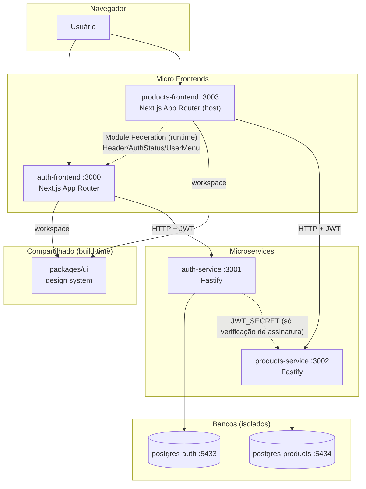

# Arquitetura — Plataforma Micro Frontends + Microservices (Auth & Products)

> Documento vivo. Atualizado a cada fase do roadmap. Ver status de implementação em `/README.md`.

---

## 01. Objetivo do projeto

Construir uma plataforma de referência que demonstra, em código real e testado, como compor uma aplicação usando **Micro Frontends** (Next.js + Module Federation) e **Microservices** (Fastify + Prisma), com dois domínios de negócio isolados — **autenticação** e **produtos** — comunicando-se por contratos explícitos (HTTP + JWT no backend, Module Federation + eventos no frontend), sem nunca compartilhar banco de dados ou lógica de negócio entre domínios.

Serve como baseline de engenharia para: Clean Architecture, SOLID, TDD com cobertura mínima de 95%, Repository Pattern, Dependency Injection e isolamento real de deploy entre partes do sistema.

**Não-objetivos:** não é um produto de catálogo de e-commerce completo (produtos são propositalmente simples — nome, preço, descrição, estoque); não cobre pagamento, frete ou carrinho.

---

## 02. Requisitos funcionais

### Auth (auth-frontend + auth-service)

| #    | Requisito                                                                                       |
| ---- | ----------------------------------------------------------------------------------------------- |
| RF01 | Usuário se cadastra com nome, email e senha                                                     |
| RF02 | Usuário faz login com email e senha, recebe access token + refresh token                        |
| RF03 | Access token expira em 15 min; sistema renova via refresh token automaticamente, sem novo login |
| RF04 | Usuário faz logout — refresh token correspondente é invalidado no banco                         |
| RF05 | Usuário visualiza seu próprio perfil (nome, email, data de criação)                             |
| RF06 | Senhas nunca trafegam nem são persistidas em texto puro (hash bcrypt)                           |

### Products (products-frontend + products-service)

| #    | Requisito                                                                                                |
| ---- | -------------------------------------------------------------------------------------------------------- |
| RF07 | Usuário autenticado lista produtos, paginados                                                            |
| RF08 | Usuário busca produtos por nome/descrição                                                                |
| RF09 | Usuário autenticado cadastra novo produto (nome, descrição, preço, estoque)                              |
| RF10 | Usuário autenticado edita produto existente                                                              |
| RF11 | Usuário autenticado exclui produto                                                                       |
| RF12 | Usuário visualiza detalhes de um produto específico                                                      |
| RF13 | Usuário não autenticado é redirecionado para `auth-frontend` ao tentar acessar qualquer rota de produtos |

### Cross-cutting

| #    | Requisito                                                                                                                                           |
| ---- | --------------------------------------------------------------------------------------------------------------------------------------------------- |
| RF14 | `products-frontend` exibe estado de autenticação (nome do usuário, avatar, logout) sem reimplementar lógica de auth — consome via Module Federation |
| RF15 | Tema (light/dark) e componentes visuais são consistentes entre os dois frontends                                                                    |

---

## 03. Requisitos não funcionais

| #     | Requisito                                                                                         | Como é atendido                                                                                   |
| ----- | ------------------------------------------------------------------------------------------------- | ------------------------------------------------------------------------------------------------- |
| RNF01 | Cobertura de testes ≥ 95% em toda camada de aplicação/domínio                                     | Vitest (frontend) + Vitest/Supertest (backend), threshold enforced em CI                          |
| RNF02 | Zero uso de `any` em TypeScript                                                                   | `strict: true` + `@typescript-eslint/no-explicit-any: error`                                      |
| RNF03 | Cada serviço/app deployável de forma 100% independente                                            | `package.json` próprio, `Dockerfile` próprio, banco próprio                                       |
| RNF04 | Nenhum serviço acessa banco de outro serviço                                                      | Bancos físicos separados (`auth_db`, `products_db`), sem VPN/rede compartilhada de DB             |
| RNF05 | Autenticação stateless entre serviços (sem chamada síncrona serviço-a-serviço para validar token) | JWT HS256 com segredo compartilhado via env var — cada serviço valida assinatura localmente       |
| RNF06 | Tempo de resposta p95 < 300ms em rotas de leitura sob carga local                                 | Índices Prisma nos campos de busca/filtro, paginação obrigatória                                  |
| RNF07 | Acessibilidade (a11y) nos componentes de UI                                                       | Radix UI (primitivas acessíveis) + `eslint-plugin-jsx-a11y`                                       |
| RNF08 | Observabilidade mínima (logs estruturados, health checks)                                         | Pino nos serviços Fastify, rotas `/health` e `/health/ready`                                      |
| RNF09 | Repositório auditável — histórico de commits semântico e rastreável                               | Conventional Commits + GitFlow, validado via `commitlint` no `commit-msg` hook                    |
| RNF10 | Segurança de senha e sessão seguindo boas práticas OWASP                                          | bcrypt (cost 10+), cookies `httpOnly`/`Secure`/`SameSite`, refresh token rotacionável e revogável |

---

## 04. Arquitetura geral



**Princípios que governam toda decisão de arquitetura neste projeto:**

1. **Isolamento de domínio primeiro.** Auth e Products nunca importam código um do outro, nunca compartilham banco. A única ponte é HTTP (backend) e Module Federation/eventos (frontend).
2. **Dependência aponta para dentro.** Em cada serviço/app, `domain` não conhece `infra`; `infra` implementa interfaces definidas em `domain`. Ver seção 13.
3. **Testável por construção.** Toda regra de negócio é isolável de I/O (banco, HTTP, filesystem) via injeção de dependência — permite testar sem mocks frágeis de framework.
4. **Cada camada só resolve um tipo de problema.** Zod valida forma; use case decide regra de negócio; repository decide acesso a dado. Nunca misturar.

---

## 05. Micro Frontends

Dois apps Next.js (App Router) totalmente independentes, cada um com seu próprio `package.json`, build, deploy e porta:

| App                 | Porta | Domínio                                                | Não pode conter                                                        |
| ------------------- | ----- | ------------------------------------------------------ | ---------------------------------------------------------------------- |
| `auth-frontend`     | 3000  | login, cadastro, logout, refresh, perfil               | lógica de produtos                                                     |
| `products-frontend` | 3003  | listagem, CRUD, busca, paginação, detalhes de produtos | lógica de autenticação (exceto checar/redirecionar se não autenticado) |

**Regra de fronteira:** `products-frontend` sabe que existe "um usuário autenticado ou não" — mas não sabe _como_ login funciona. Essa fronteira é o contrato exposto por Module Federation (seção 06) + a API pública do `auth-service` (seção 09).

Cada MFE segue a estrutura feature-based descrita em `references/architecture.md` da skill: `features/<domínio>/<subfeature>/{components,hooks,services,schemas,types}` com `index.ts` de contrato público.

---

## 06. Module Federation (Webpack 5)

**Biblioteca:** `@module-federation/nextjs-mf` (Webpack 5 `ModuleFederationPlugin` sob o capô, adaptado pro build do Next.js).

**Topologia decidida (Fase 0):** federação direta, sem app "shell". `products-frontend` é **host**; `auth-frontend` é **remote**.

```js
// apps/auth-frontend/next.config.js — expõe
new NextFederationPlugin({
  name: 'authFrontend',
  filename: 'static/chunks/remoteEntry.js',
  exposes: {
    './Header': './src/components/Header',
    './AuthStatus': './src/components/AuthStatus',
    './UserMenu': './src/components/UserMenu',
  },
  shared: { react: { singleton: true }, 'react-dom': { singleton: true } },
})
```

```js
// apps/products-frontend/next.config.js — consome
new NextFederationPlugin({
  name: 'productsFrontend',
  remotes: {
    authFrontend: `authFrontend@${process.env.NEXT_PUBLIC_AUTH_FRONTEND_URL}/_next/static/chunks/remoteEntry.js`,
  },
  shared: { react: { singleton: true }, 'react-dom': { singleton: true } },
})
```

**Regras obrigatórias:**

- Só componentes `"use client"` são expostos. **Rotas de página nunca são federadas** — RSC (React Server Components) não federa de forma estável entre apps Next.js independentes; federar página quebraria streaming/SSR do host.
- Componentes remotos são importados via `dynamic(() => import('authFrontend/Header'), { ssr: false })` — nunca `ssr: true` num remote (o remote não está disponível durante o build do host).
- `auth-frontend` precisa estar rodando (dev) ou deployado (prod) para `products-frontend` funcionar plenamente — em caso de falha ao carregar o remote, `products-frontend` cai num fallback local mínimo (ver `ErrorBoundary` em torno do `dynamic import`).
- `react`/`react-dom` são `singleton: true` — nunca duas cópias de React na mesma página (quebraria hooks).

---

## 07. Shared Packages

| Pacote                                      | O que compartilha                                                                                 | Mecanismo                 | Quando muda                                                                   |
| ------------------------------------------- | ------------------------------------------------------------------------------------------------- | ------------------------- | ----------------------------------------------------------------------------- |
| `packages/ui`                               | Primitivas visuais estáticas (Button, Input, Card, Modal, Toast, Loading, Error, Layout, Sidebar) | npm workspace, build-time | Só quando o pacote é republicado/reinstalado — não em runtime                 |
| Module Federation exposes (`auth-frontend`) | `Header`, `AuthStatus`, `UserMenu` — componentes com **estado vivo** de sessão                    | Webpack remote, runtime   | A cada deploy do `auth-frontend`, sem precisar redeployar `products-frontend` |

**Por que os dois mecanismos coexistem:** um Design System não muda por usuário logado — é seguro compartilhar em build-time. Já o estado "quem está logado agora" só existe no domínio de auth em runtime — só faz sentido via um remote que o dono do domínio publica e controla.

`packages/ui` não tem build step próprio (Fase 1) — exporta `src/` direto; apps consumidores usam `transpilePackages: ['@microfrontends/ui']` no `next.config.js`.

---

## 08. Design System

Base: **shadcn/ui** (componentes copiados/customizáveis, não pacote fechado) + **Radix UI** (acessibilidade) + **class-variance-authority** (variantes tipadas) + Tailwind com CSS variables de tema (light/dark).

Componentes obrigatórios em `packages/ui` (ver seção 07): `Button`, `Input`, `Card`, `Modal`, `Toast`, `Loading`, `Error`, `Layout`, `Header`, `Sidebar`.

**Regras:**

- Nunca cor Tailwind hardcoded (`bg-blue-500`) — sempre CSS variable semântica (`bg-primary`).
- Extensão de comportamento via slots/`children`/compound components — nunca props booleanas (`showX`) que ramificam a lógica interna do componente (viola OCP).
- `Sidebar`/`Header` não importam `next/navigation` — recebem `active`/estado via props. Quem decide o que está "ativo" é o app consumidor (mantém o design system framework-agnostic e testável sem mocks de Next.js).

---

## 09. Auth Service

Fastify + Prisma + PostgreSQL (`auth_db`, porta 5433). Dono exclusivo dos dados de identidade.

### Rotas

| Método | Rota        | Descrição                                                                 | Auth requerida         |
| ------ | ----------- | ------------------------------------------------------------------------- | ---------------------- |
| POST   | `/register` | Cria usuário (hash bcrypt da senha)                                       | Não                    |
| POST   | `/login`    | Autentica, retorna access token (corpo) + refresh token (cookie httpOnly) | Não                    |
| POST   | `/refresh`  | Emite novo access token a partir do refresh token válido                  | Refresh token (cookie) |
| POST   | `/logout`   | Revoga o refresh token atual                                              | Access token           |
| GET    | `/me`       | Retorna perfil do usuário autenticado                                     | Access token           |

### Modelo de dados

```
User          { id, name, email (unique), passwordHash, createdAt, updatedAt }
RefreshToken  { id, token (hash), userId (FK), expiresAt, revokedAt (nullable), createdAt }
```

Refresh token é armazenado como hash (não em texto puro) — mesmo em caso de vazamento de banco, tokens não são diretamente reutilizáveis. Rotação: a cada `/refresh`, o token antigo é revogado e um novo é emitido (refresh token rotation), mitigando replay de token roubado.

---

## 10. Products Service

Fastify + Prisma + PostgreSQL (`products_db`, porta 5434). Dono exclusivo do catálogo.

### Rotas

| Método | Rota            | Descrição                                                         | Auth requerida |
| ------ | --------------- | ----------------------------------------------------------------- | -------------- |
| GET    | `/products`     | Lista paginada, com filtros de busca (`?q=`, `?page=`, `?limit=`) | Access token   |
| GET    | `/products/:id` | Detalhe de um produto                                             | Access token   |
| POST   | `/products`     | Cria produto                                                      | Access token   |
| PUT    | `/products/:id` | Atualiza produto                                                  | Access token   |
| DELETE | `/products/:id` | Remove produto                                                    | Access token   |

### Modelo de dados

```
Product { id, name, description, price (decimal), stock (int), createdAt, updatedAt }
```

### Validação de autenticação sem acoplamento a auth-service

`products-service` **não chama `auth-service` por rede** pra validar token. Um middleware Fastify (`onRequest` hook) decodifica e verifica a assinatura JWT localmente usando `JWT_SECRET` (env var compartilhada entre os dois serviços). Se a assinatura é válida e o token não expirou, a requisição segue com `request.user = { id, email }` no contexto. Isso mantém os dois serviços desacoplados em runtime (nenhum é dependência de disponibilidade do outro para validar sessão).

---

## 11. Banco de dados

**Regra inegociável: um banco físico por serviço, nunca compartilhado.**

| Serviço            | Banco         | Porta (local) | Tabelas                |
| ------------------ | ------------- | ------------- | ---------------------- |
| `auth-service`     | `auth_db`     | 5433          | `User`, `RefreshToken` |
| `products-service` | `products_db` | 5434          | `Product`              |

Cada serviço tem sua própria connection string (`AUTH_DATABASE_URL` / `PRODUCTS_DATABASE_URL`), seu próprio container Postgres no `docker-compose.yml`, e seu próprio ciclo de migrations. Não existem foreign keys entre bancos (impossível fisicamente) — relação `Product.createdByUserId`, se necessária, é armazenada como valor solto (UUID), sem FK, validada por contrato de API, não por constraint de banco.

---

## 12. Prisma

Cada serviço tem seu próprio `prisma/schema.prisma`, `prisma/migrations/`, e `prisma/seed.ts`.

**Regra inegociável: regra de negócio nunca importa `@prisma/client` diretamente.** Fluxo obrigatório:

```
Use Case → interface Repository (domain) → implementação Prisma (infra)
```

```ts
// domain/repositories/user-repository.ts — abstração, sem Prisma
export interface UserRepository {
  findByEmail(email: string): Promise<User | null>
  create(data: CreateUserData): Promise<User>
}

// infra/database/prisma/prisma-user-repository.ts — detalhe de implementação
export class PrismaUserRepository implements UserRepository {
  constructor(private readonly prisma: PrismaClient) {}
  async findByEmail(email: string) {
    return this.prisma.user.findUnique({ where: { email } })
  }
  async create(data: CreateUserData) {
    return this.prisma.user.create({ data })
  }
}
```

Isso permite testar use cases com um `InMemoryUserRepository` (fake), sem subir Postgres — testes de unidade rápidos e determinísticos. Testes de integração (contra Postgres real via Testcontainers) cobrem só a implementação concreta do repository.

---

## 13. Clean Architecture

Camadas por serviço backend:

```
domain/         → entities, interfaces de repository, regras de negócio puras (sem framework)
application/    → use cases (orquestram domain), DTOs, erros de aplicação
infra/          → implementações concretas: Prisma repositories, HTTP (Fastify controllers/rotas), middlewares
main/           → composition root: server.ts monta tudo (injeção de dependência manual/factory)
```

Regra de dependência: setas sempre apontam pra dentro.

```
infra → application → domain
main  → infra (monta) + application (usa)
```

`domain` nunca importa de `application` ou `infra`. `application` nunca importa `infra` diretamente — recebe implementações via injeção (parâmetro de factory/construtor), respeitando DIP (seção 14).

No frontend, o equivalente é:

```
View (page/componente) → Controller (orquestra estado) → Service (regra de negócio) → Repository (acesso a dados) → API
```

Ver `references/architecture.md` da skill pra exemplos completos de cada camada.

---

## 14. SOLID

Aplicação concreta neste projeto (exemplos completos em `references/architecture.md`):

| Princípio | Onde aparece aqui                                                                                                                           |
| --------- | ------------------------------------------------------------------------------------------------------------------------------------------- |
| **S**RP   | Cada use case faz uma coisa (`RegisterUserUseCase`, `LoginUseCase` — nunca um `AuthUseCase` genérico)                                       |
| **O**CP   | Componentes de UI estendidos via slots/children (`DataTable` com `toolbar`/`emptyState`), nunca props booleanas                             |
| **L**SP   | Qualquer `UserRepository` (Prisma real ou InMemory fake) é intercambiável nos use cases sem alterar comportamento externo                   |
| **I**SP   | Hooks segregados por operação (`useCreateProduct`, `useUpdateProduct` — nunca um hook `useProductActions` genérico)                         |
| **D**IP   | Use cases recebem `Repository` por interface no construtor; Fastify controller recebe use case já instanciado (composition root em `main/`) |

---

## 15. TDD obrigatório

Ciclo aplicado a **toda** funcionalidade, sem exceção, em ambos os lados (frontend/backend):

```
1. Escrever teste que descreve o comportamento esperado
2. Rodar — ver falhar (RED) — confirma que o teste testa algo real
3. Implementar o mínimo pra passar (GREEN)
4. Refatorar mantendo os testes verdes
5. Validar cobertura da funcionalidade
```

Nenhum código de produção é escrito sem um teste falhando antes que o justifique. Commits de funcionalidade sempre incluem teste + implementação juntos (ou teste primeiro, em commit separado `test:` seguido de `feat:`).

---

## 16. Estratégia de testes (Frontend e Backend)

### Backend (Vitest + Supertest)

| Camada                             | Tipo de teste | Isolamento                                                                       |
| ---------------------------------- | ------------- | -------------------------------------------------------------------------------- |
| `domain`/`application` (use cases) | Unitário      | `Repository` fake/in-memory, sem banco                                           |
| `infra/repositories`               | Integração    | Postgres real via Testcontainers                                                 |
| `infra/http` (controllers/rotas)   | Integração    | Supertest contra instância Fastify em memória, use cases reais + repository fake |
| `infra/middlewares`                | Unitário      | Request/reply mockados                                                           |

### Frontend (Vitest + Testing Library + MSW)

| Camada                  | Tipo de teste                                   | Isolamento                                                                           |
| ----------------------- | ----------------------------------------------- | ------------------------------------------------------------------------------------ |
| Componentes             | Comportamento (render, interação, a11y)         | Testing Library, nunca snapshot puro                                                 |
| Hooks (TanStack Query)  | Comportamento (loading/success/error)           | MSW intercepta toda chamada HTTP — nunca API real, nunca `fetch` mockado manualmente |
| Forms                   | Fluxo completo (preencher → validar → submeter) | `user-event`, MSW                                                                    |
| Features isoladas (MFE) | Contrato público (`index.ts`)                   | Mock de `CustomEvent`/remote, nunca sub-caminho interno de outra feature             |

**Regra absoluta:** nenhum teste, em nenhum dos dois lados, depende de rede real ou serviço real rodando. Backend usa fakes/Testcontainers; frontend usa MSW.

Cobertura mínima: **95%** em `domain`, `application` (backend) e `hooks`/`services` (frontend) — medida por `vitest run --coverage` com `thresholds` configurado (falha o build se cair abaixo).

---

## 17. TanStack Query

Uso obrigatório para **todo** dado remoto no frontend — nunca `fetch`/`axios` direto em `useEffect`.

| Recurso            | Uso neste projeto                                                                                                        |
| ------------------ | ------------------------------------------------------------------------------------------------------------------------ |
| `QueryClient`      | Uma instância por app (singleton em `lib/query-client.ts`), com `HydrationBoundary` pra SSR                              |
| Custom hooks       | Um hook por operação (`useLogin`, `useProducts`, `useCreateProduct`) — nunca hook genérico                               |
| Mutations          | `useMutation` com `onSuccess` invalidando a query key relacionada                                                        |
| Infinite Query     | Listagem de produtos usa `useInfiniteQuery` (scroll infinito) como alternativa à paginação numerada, conforme UX da tela |
| Optimistic Updates | Edição/exclusão de produto atualiza o cache local antes da resposta do servidor, com rollback em `onError`               |
| Invalidation       | Toda mutation de escrita invalida a query key de listagem correspondente                                                 |
| Retry              | 3 tentativas com backoff exponencial em queries de leitura; mutations nunca fazem retry automático (evita duplicar POST) |
| Suspense           | Listagens críticas usam `useSuspenseQuery` + `<Suspense>` com skeleton                                                   |

Camada de acesso HTTP nunca fica dentro do componente nem do hook — fica em `services/*.service.ts`, injetada no hook (DIP).

---

## 18. Segurança

| Ameaça                           | Mitigação                                                                                      |
| -------------------------------- | ---------------------------------------------------------------------------------------------- |
| Senha em texto puro              | bcrypt, salt rounds ≥ 10, nunca logada nem retornada em nenhuma resposta de API                |
| Roubo de access token via XSS    | Access token de curta duração (15 min), mantido em memória no frontend (não em `localStorage`) |
| Roubo de refresh token           | Cookie `httpOnly` + `Secure` + `SameSite=Strict`, hash no banco, rotação a cada uso            |
| Replay de refresh token revogado | Verificação de `revokedAt` no banco antes de emitir novo access token                          |
| CSRF                             | `SameSite=Strict` nos cookies + verificação de origem (`Origin`/`Referer`) em rotas mutáveis   |
| Força bruta em `/login`          | Rate limiting (`@fastify/rate-limit`) por IP + email                                           |
| Enumeração de usuário            | Mensagens de erro genéricas em login/registro (não revelar se o email existe)                  |
| Injeção SQL                      | Prisma (queries parametrizadas por construção) — nunca query raw concatenando input do usuário |
| Validação de entrada ausente     | Zod em toda fronteira: body/query/params de rota, variáveis de ambiente, formulários           |
| Segredos versionados             | `.env` no `.gitignore`; `.env.example` documenta chaves sem valores reais                      |
| Cabeçalhos HTTP inseguros        | `@fastify/helmet` em ambos os serviços                                                         |
| CORS aberto                      | `@fastify/cors` com origem explícita (só as URLs dos frontends conhecidas)                     |

---

## 19. Docker

Cada um dos 4 projetos tem seu próprio `Dockerfile` multi-stage (`deps` → `build` → `runtime`), imagem final mínima (`node:20-alpine`), usuário non-root, e `HEALTHCHECK` apontando pra rota de health do próprio app/serviço.

Exemplo de shape (detalhado por serviço na fase de implementação correspondente):

```dockerfile
FROM node:20-alpine AS deps
# instala deps de produção do workspace específico

FROM node:20-alpine AS build
# build (tsc / next build)

FROM node:20-alpine AS runtime
USER node
HEALTHCHECK CMD wget -qO- http://localhost:$PORT/health || exit 1
CMD ["node", "dist/main/server.js"]
```

---

## 20. Docker Compose

`docker-compose.yml` na raiz orquestra o stack completo: `postgres-auth`, `postgres-products`, `auth-service`, `products-service`, `auth-frontend`, `products-frontend`, ligados por uma rede Docker interna, com `depends_on` + `condition: service_healthy` garantindo ordem de subida (bancos → serviços → frontends). Skeleton atual (Fase 0) só tem os dois bancos; os demais serviços entram nas Fases 2–5, cada um adicionado + validado (`docker compose up`) na fase em que é implementado.

---

## 21. CI/CD

Pipeline (GitHub Actions, um workflow por tipo de check, disparado em PR para `develop`/`main`):

| Job                                    | O que roda                                                       | Bloqueia merge se falhar |
| -------------------------------------- | ---------------------------------------------------------------- | ------------------------ |
| `lint`                                 | ESLint + Prettier check em todos os workspaces alterados         | Sim                      |
| `typecheck`                            | `tsc --noEmit` em todos os workspaces alterados                  | Sim                      |
| `test`                                 | Vitest (frontend) + Vitest/Supertest (backend), com `--coverage` | Sim                      |
| `coverage-gate`                        | Falha se cobertura de algum workspace < 95%                      | Sim                      |
| `build`                                | Build de produção de cada app/serviço alterado                   | Sim                      |
| `docker-build` (só em push pra `main`) | Build das imagens Docker de cada projeto                         | Sim                      |

Estratégia de monorepo no CI: jobs rodam só nos workspaces afetados pelo diff (evita rebuildar tudo a cada PR pequeno) — detalhado na Fase 6/7 quando o pipeline é escrito.

---

## 22. Git Flow

Branches permanentes: `main` (produção, tags SemVer) e `develop` (integração). Trabalho sempre em `feature/<nome>`, `release/<versão>` ou `hotfix/<descrição>`, nunca commit direto em `main`/`develop`. Fluxo completo, comandos exatos e regras de merge `--no-ff` documentados em `references/git.md` da skill — seguido à risca neste projeto (ver histórico: `main` iniciado com commit vazio, `develop` recebe o scaffold real via merge de feature branches).

---

## 23. Conventional Commits

Formato obrigatório, validado pelo hook `commit-msg` (`commitlint` + `@commitlint/config-conventional`):

```
<tipo>(<escopo>): <descrição no imperativo, minúsculas, sem ponto final>
```

Tipos usados neste projeto: `feat`, `fix`, `chore`, `refactor`, `test`, `docs`, `style`, `perf`, `ci`. Exemplos reais já no histórico: `chore: scaffold monorepo with npm workspaces and tooling`.

---

## 24. ESLint / Prettier / Husky

- **ESLint:** config base compartilhada (`.eslintrc.base.json` na raiz) com `@typescript-eslint/recommended` + `recommended-requiring-type-checking`, `no-explicit-any: error`. Cada app/pacote estende e adiciona plugins específicos (ex.: `packages/ui` adiciona `react`, `react-hooks`, `jsx-a11y`).
- **Prettier:** `.prettierrc` único na raiz (sem ponto e vírgula, aspas simples, trailing comma), aplicado via `lint-staged` no pre-commit.
- **Husky:** `.husky/pre-commit` roda `lint-staged` (Prettier nos arquivos staged); `.husky/commit-msg` roda `commitlint`. Ambos testados e funcionando desde a Fase 0.
- **EditorConfig:** `.editorconfig` na raiz garante LF, UTF-8, indentação de 2 espaços consistente entre editores.

---

## 25. Observabilidade (Pino, OpenTelemetry, Health Checks)

| Item                | Ferramenta                                                                       | Onde                                                                                                                                                                                        |
| ------------------- | -------------------------------------------------------------------------------- | ------------------------------------------------------------------------------------------------------------------------------------------------------------------------------------------- |
| Logging estruturado | **Pino** (logger nativo do Fastify)                                              | `auth-service`, `products-service` — JSON estruturado, nível configurável via `LOG_LEVEL`                                                                                                   |
| Tracing distribuído | **OpenTelemetry** (`@opentelemetry/sdk-node` + auto-instrumentation HTTP/Prisma) | Ambos os serviços — exporta pra console em dev, OTLP collector em produção (endpoint configurável via env)                                                                                  |
| Health checks       | Rotas dedicadas                                                                  | `GET /health` (liveness — processo de pé) e `GET /health/ready` (readiness — banco acessível) em cada serviço, usadas pelo `HEALTHCHECK` do Docker e pelo `depends_on.condition` do compose |

Correlação: cada requisição recebe um `x-request-id` (gerado ou propagado), logado em todo log daquela requisição e incluído no trace — permite seguir uma requisição do frontend até o banco.

---

## 26. Logging

Regras práticas:

- Nunca `console.log` em código de produção (`no-console` no ESLint permite só `warn`/`error`).
- Backend: Pino via `request.log` do Fastify (já inclui `request-id`, método, rota, status, duração).
- Nunca logar dado sensível: senha, token (mesmo hash), cookie, header `Authorization`. Sanitização via `redact` do Pino nesses campos.
- Nível por ambiente: `debug` em dev, `info` em produção; `error` sempre com stack trace estruturado (nunca `String(error)` perdendo contexto).
- Frontend: erros de mutation/query logados via `onError` do TanStack Query pra um serviço de monitoramento (a integrar na Fase 6/7) — nunca só `console.error` silencioso.

---

## 27. Tratamento de erros

### Backend

Hierarquia de erros de aplicação (`application/errors/`), cada um mapeado a um status HTTP no error handler global do Fastify:

```
AppError (base, abstrata)
├── ValidationError        → 400
├── UnauthorizedError       → 401
├── ForbiddenError          → 403
├── NotFoundError           → 404
├── ConflictError           → 409  (ex.: email já cadastrado)
└── InternalError           → 500  (nunca expõe stack/detalhes internos na resposta)
```

Use cases lançam esses erros; nunca lançam `Error` genérico. Controller nunca faz `try/catch` de regra de negócio — delega ao error handler global do Fastify (`setErrorHandler`), que serializa `{ statusCode, error, message }` de forma consistente.

### Frontend

- Erros de query/mutation nunca aparecem como tela branca — `error.tsx` (Next.js) por rota + `ErrorBoundary` em componentes críticos.
- Mensagens de erro de API são mapeadas para texto amigável (nunca exibir mensagem crua do backend) via um dicionário de erros por código.
- Falha ao carregar remote do Module Federation (`auth-frontend` fora do ar) tem fallback visual próprio, não quebra a página inteira do `products-frontend`.

---

## 28. Performance

| Técnica                               | Onde                                                                                                      |
| ------------------------------------- | --------------------------------------------------------------------------------------------------------- |
| Server Components por padrão          | Toda página Next.js que não precisa de interatividade                                                     |
| `prefetchQuery` + `HydrationBoundary` | Dados críticos da rota inicial (lista de produtos, perfil do usuário)                                     |
| Paginação/Infinite Query              | Nunca carregar lista completa de produtos de uma vez                                                      |
| Índices no banco                      | `Product.name` (busca), `User.email` (unique + lookup de login), `RefreshToken.token` (lookup de refresh) |
| `React.memo`/`useMemo`/`useCallback`  | Componentes de lista com muitos itens, callbacks passados como prop pra listas                            |
| Connection pooling Prisma             | `connection_limit` configurado por serviço, evita esgotar conexões do Postgres sob carga                  |
| Cache HTTP                            | Rotas de leitura pública (nenhuma, neste projeto, já que tudo exige auth) — N/A por ora                   |

---

## 29. Deploy

Cada projeto builda e deploya independentemente — não existe "deploy da plataforma" como unidade única.

1. **Serviços (`auth-service`, `products-service`):** imagem Docker publicada em registry, deployada em qualquer orquestrador (Docker Compose em staging local; Kubernetes/ECS/Cloud Run em produção — não prescrito neste projeto, documentado como próximo passo na Fase 6/7).
2. **Frontends (`auth-frontend`, `products-frontend`):** build Next.js standalone, containerizado da mesma forma, ou deploy em plataforma serverless compatível (Vercel) — exige atenção especial ao Module Federation (remote precisa de URL pública estável e CORS liberado pro host).
3. **Migrations de banco:** rodadas via `prisma migrate deploy` como step de deploy do serviço correspondente, antes do container novo receber tráfego (readiness gate).
4. **Ordem seguindo dependência:** bancos → serviços → `auth-frontend` (dono do remote) → `products-frontend` (consome o remote).

Detalhamento de pipeline de deploy real fica pra Fase 6 (integração) / Fase 7 (documentação final), quando os 4 projetos existirem de fato.

---

## 30. Critérios de aceite

Uma fase do roadmap (seção 31) só é considerada **concluída** quando:

- [ ] Todo comportamento descrito nos requisitos funcionais da fase tem teste automatizado cobrindo golden path + erro + edge case relevante
- [ ] Cobertura da fase ≥ 95% (`vitest run --coverage`)
- [ ] `tsc --noEmit` sem erros
- [ ] `npm run build` do(s) workspace(s) da fase sem erros
- [ ] `npm run lint` sem erros
- [ ] Nenhum `any`, nenhum `TODO`/`FIXME` sem issue associada
- [ ] README do projeto/pacote da fase atualizado (funcionalidades, env vars, como rodar)
- [ ] Fluxo testado manualmente ponta a ponta (quando há UI) — não só teste automatizado
- [ ] Commit(s) da fase seguem Conventional Commits e foram mergeados em `develop` via `feature/*` com `--no-ff`

---

## 31. Roadmap de implementação

```
Fase 0 → Scaffold monorepo + tooling + docker-compose skeleton                    [CONCLUÍDA]
Fase 1 → packages/ui (design system compartilhado)                                [EM ANDAMENTO]
Fase 2 → auth-service (backend completo, TDD)
Fase 3 → auth-frontend (MFE completo, TDD)
Fase 4 → products-service (backend completo, TDD)
Fase 5 → products-frontend (MFE completo, TDD)
Fase 6 → Module Federation wiring + docker-compose completo + smoke e2e + CI/CD
Fase 7 → Documentação final consolidada + observabilidade + revisão de segurança
```

Cada fase segue o ciclo descrito na seção 15 (TDD) e só avança pra próxima após validação com o responsável pelo projeto (checkpoint manual, não automático).

---

## 32. Regras para a IA seguir durante o desenvolvimento

1. **Nunca pular etapas.** Antes de codar uma funcionalidade: explicar arquitetura → escrever teste → rodar e ver falhar → implementar → refatorar → validar cobertura.
2. **Nunca usar `any`.** Se o tipo é genuinamente desconhecido, modelar com `unknown` + type guard, ou schema Zod.
3. **Nunca acessar Prisma fora de `infra/repositories`.** Regra de negócio depende de interface, não de implementação.
4. **Nunca fetch em `useEffect`.** Todo dado remoto passa por TanStack Query + camada `services/`.
5. **Nunca misturar responsabilidade.** Um arquivo, uma razão pra mudar (SRP) — componente não valida, service não renderiza, controller não faz query direta.
6. **Nunca testar implementação interna.** Teste observa comportamento (o que o usuário vê/recebe), não estado interno de hook/classe.
7. **Nunca commitar sem passar pela ordem:** tipos → build → testes → README → commit (ver `references/git.md`).
8. **Nunca introduzir acoplamento entre `auth-frontend` e `products-frontend`** além do contrato explícito de Module Federation definido na seção 06 — nenhum import direto de código interno de um pro outro.
9. **Sempre justificar decisão arquitetural não-óbvia** com uma linha de "porquê", não só "o quê" (comentários no código só quando o porquê não é derivável do nome/estrutura).
10. **Sempre atualizar este documento** quando uma decisão de arquitetura mudar durante a implementação de uma fase — este arquivo reflete a arquitetura real, não a intenção inicial.
